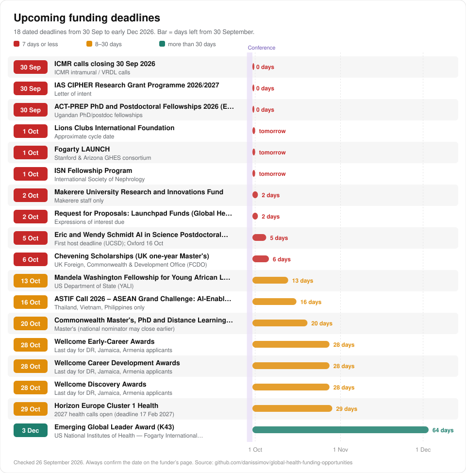

# Global Health Funding Opportunities

> Where health workers in ten partner countries can find money for research, training and service projects.

204 funding opportunities for clinicians, nurses, public-health staff and faculty in the Dominican Republic, Jamaica, Armenia, India, Thailand, Vietnam, the Philippines, Uganda, Zimbabwe and Botswana, from ministries and national research councils to global foundations. Checked against the funders' own pages in September 2026.

Free to use, copy and share (CC0). Made for the 5th Annual Global Health Conference, Southbury, Connecticut, September 2026.

*Pick your country below, or open the [interactive atlas](https://danissimov.github.io/global-health-funding-opportunities/) to filter by country, status and topic.*

## Contents

- [Start with your country](#start-with-your-country)
- [How to use this list](#how-to-use-this-list)
- [What changed in 2026](#what-changed-in-2026)
- [Start here](#start-here)
- [Next deadlines](#next-deadlines)
- [National and domestic funders](#national-and-domestic-funders)
- [Regional bodies and development banks](#regional-bodies-and-development-banks)
- [Multilateral and global health initiatives](#multilateral-and-global-health-initiatives)
- [Foreign governments and research councils](#foreign-governments-and-research-councils)
- [Foundations and charities](#foundations-and-charities)
- [Corporate and tech, including AI](#corporate-and-tech-including-ai)
- [Fellowships, training and small grants](#fellowships-training-and-small-grants)
- [Humanitarian and implementation](#humanitarian-and-implementation)
- [Search tools](#search-tools)
- [Not direct routes](#not-direct-routes)
- [How to cite](#how-to-cite)
- [Author](#author)
- [Contributing](#contributing)
- [Methodology and assumptions](#methodology-and-assumptions)

## Start with your country

Each page shows which funder lists your country is on, the five best first moves, the deadlines, and every opportunity open to you.

| Country                                                   | Income group (World Bank, July 2026)    | Domestic funding                                 |
| --------------------------------------------------------- | --------------------------------------- | ------------------------------------------------ |
| **[Dominican Republic](countries/dominican-republic.md)** | Upper-middle income                     | Thin                                             |
| **[Jamaica](countries/jamaica.md)**                       | Upper-middle income                     | Thin to moderate                                 |
| **[Armenia](countries/armenia.md)**                       | Upper-middle income                     | Moderate                                         |
| **[India](countries/india.md)**                           | Lower-middle income                     | Strong                                           |
| **[Thailand](countries/thailand.md)**                     | Upper-middle income                     | Moderate to strong                               |
| **[Vietnam](countries/vietnam.md)**                       | Upper-middle income (since 1 July 2026) | Moderate                                         |
| **[Philippines](countries/philippines.md)**               | Upper-middle income (since 1 July 2026) | Strong                                           |
| **[Uganda](countries/uganda.md)**                         | Low income                              | Moderate (mostly Makerere University)            |
| **[Zimbabwe](countries/zimbabwe.md)**                     | Lower-middle income                     | Thin                                             |
| **[Botswana](countries/botswana.md)**                     | Upper-middle income                     | Thin (a new national research council is coming) |

## How to use this list

> [!WARNING]
> Funding changed fast in 2026. Statuses and dates are as of 26 September 2026. Always read the current call on the funder's website before you start. This list is information, not legal or financial advice.

**Reading an entry.** Each line gives the scheme (linked to the funder's page), what it funds, the amount when known, which of the ten countries can apply, and the status in italics. `best fit` marks opportunities that suit people doing research alongside clinical work. `AI` marks opportunities about AI or data.

**Finding your own opportunities.** The six steps behind this list:

1. **Know which lists you are on.** Check your World Bank income group (it changes every 1 July), OECD aid status, Commonwealth membership, Horizon Europe association, EDCTP membership and Wellcome's country list. Most eligibility rules are written against these lists.
2. **Map who already funds health at home.** Open the IATI d-portal or the OECD CRS for your country and filter to health. The funders you see there are your likeliest partners.
3. **Find people funded for similar work.** Search NIH RePORTER, Dimensions, Wellcome's funded grants and 360Giving GrantNav by topic and country. Funded researchers become mentors, co-applicants and referees.
4. **Subscribe to five feeds, not fifty.** The TDR newsletter, Fogarty funding news, The Global Health Network, one aggregator such as fundsforNGOs or Opportunity Desk, and your national council's call page.
5. **Let AI search, then check every line.** A deep-research prompt builds a long list quickly. Then open each official page. Deadlines, amounts and country lists are exactly where AI models make mistakes.
6. **Track it and register early.** Keep a tracker with the deadline, the eligibility check and your next action. US federal applications need SAM.gov, NCAGE and eRA Commons registration, which takes weeks.

The full guide, with a copy-and-paste AI prompt, is in [the search guide](docs/how-to-search.md).

The prompts from the talk, one for each research stage, are in [the prompt sheet](docs/prompts.md).

**Preparing applications faster.** Write your facility and project down once, as plain facts and numbers, and paste that file into every grant chat. Use [the project profile template](examples/project-profile-template.md); [a filled example](examples/west-nile-lab-stripseq.md) shows a fictional lab in Uganda.

## What changed in 2026

Read these first. They decide which lists your country is on.

| Change                                                   | What it means for you                                                                                                                                                                                                                                                                                                                                                                 |
| -------------------------------------------------------- | ------------------------------------------------------------------------------------------------------------------------------------------------------------------------------------------------------------------------------------------------------------------------------------------------------------------------------------------------------------------------------------- |
| **USAID is closed**                                      | It closed in July 2025. The US State Department has signed health agreements with 35 countries: US$24.1 billion for 2026 to 2030, with US funding about 34% lower in those countries. The money goes to ministries, not to researchers.                                                                                                                                               |
| **Fogarty survives, for now**                            | The NIH Fogarty International Center kept US$95 million for 2026, but the 2027 budget proposal would close it. Its only open call is the K43 career award, due 3 December 2026. NIH no longer allows foreign subawards; foreign partners now get their own linked awards.                                                                                                             |
| **UK aid is smaller and narrower**                       | UK aid is falling to 0.3% of national income. NIHR Global Health Research now funds only sub-Saharan Africa and South Asia: India, Uganda, Zimbabwe and Botswana on our map.                                                                                                                                                                                                          |
| **Wellcome narrows its countries on 29 October 2026**    | Its main schemes will accept only the UK and low and middle-income countries in Africa, South Asia and South-East Asia. The Dominican Republic, Jamaica and Armenia lose eligibility after 28 October.                                                                                                                                                                                |
| **The Philippines and Vietnam moved up**                 | The World Bank made both upper-middle income on 1 July 2026. Seven of the ten countries are now upper-middle income. Schemes only for low and lower-middle income countries now cover India, Zimbabwe and Uganda.                                                                                                                                                                     |
| **Free or cheap AI access is now real, mostly for NGOs** | Gates pledged at least US$1 billion for AI on 15 September 2026, through existing partners so far. Health NGOs in all ten countries can get Claude for US$3 a seat, Gemini and NotebookLM free through Google for Nonprofits, and discounted ChatGPT. Researchers can apply for Anthropic AI for Science credits. Hospitals and universities are excluded from most nonprofit offers. |
| **WHO and the Global Fund have less to give**            | The WHO budget for 2026 to 2027 is about 21% below plan after the US left. The Global Fund raised US$12.64 billion. For some HIV and TB grants in Thailand, Botswana, Armenia, Jamaica, the Dominican Republic and Vietnam, 2026 to 2028 is the last allocation.                                                                                                                      |

## Start here

Open to all ten countries, free to try, and suited to people doing research alongside clinical work.

| Opportunity                                                                                                                                       | Why start here                                                          |
| ------------------------------------------------------------------------------------------------------------------------------------------------- | ----------------------------------------------------------------------- |
| **[SORT IT - Structured Operational Research and Training IniTiative](https://tdr.who.int/activities/sort-it-operational-research-and-training)** | Free and mentored. You finish with a published paper.                   |
| **[Rotary Foundation Global Grants and District Grants](https://www.rotary.org/get-involved/our-programs/grants)**                                | US$30,000 to 400,000 for service projects, through a local Rotary club. |
| **[AI for Science Program (API credits)](https://support.claude.com/en/articles/11199177-anthropic-s-ai-for-science-program)**                    | Free AI credits for research. Reviewed every month.                     |
| **[Rising Scholars (formerly AuthorAID, INASP)](https://risingscholars.net/en/)**                                                                 | Free courses and mentors for writing papers and proposals.              |
| **[Emerging Global Leader Award (K43)](https://www.fic.nih.gov/Programs/Pages/emerging-global-leader.aspx)**                                      | Your institution applies directly to NIH. Due 3 December 2026.          |

## Next deadlines

The same deadlines as a table, with links

| Date        | Opportunity                                                                                                                                                                            | Note                                            |
| ----------- | -------------------------------------------------------------------------------------------------------------------------------------------------------------------------------------- | ----------------------------------------------- |
| 29 Sep 2026 | [Gates Foundation Global Grand Challenges – open RFPs](https://gcgh.grandchallenges.org/grant-opportunities)                                                                           | Low-cost pathogen sequencing RFP                |
| 30 Sep 2026 | [ICMR calls closing 30 Sep 2026](https://www.icmr.gov.in/post/call-for-proposals-under-icmr-intramural-research-program-2026-last-date-of-submission-september-30-2026-till-17-00-hrs) | ICMR intramural / VRDL calls                    |
| 30 Sep 2026 | [IAS CIPHER Research Grant Programme 2026/2027](https://www.iasociety.org/grants/cipher-grant-programme-2026-2027)                                                                     | Letter of intent                                |
| 30 Sep 2026 | [ACT-PREP PhD and Postdoctoral Fellowships 2026 (EDCTP3-funded)](https://act-prep.org/opportunities/)                                                                                  | Ugandan PhD/postdoc fellowships                 |
| 1 Oct 2026  | [Lions Clubs International Foundation](https://www.lionsclubs.org/en/lcif-grants-toolkit)                                                                                              | Approximate cycle date                          |
| 1 Oct 2026  | [Fogarty LAUNCH](https://www.fic.nih.gov/Programs/Pages/scholars-fellows-global-health.aspx)                                                                                           | Stanford & Arizona GHES consortium              |
| 1 Oct 2026  | [ISN Fellowship Program](https://fellowship.theisn.org/)                                                                                                                               | Closes                                          |
| 2 Oct 2026  | [Makerere University Research and Innovations Fund](https://rif.mak.ac.ug/rif8-call-for-applications-fy-2026-27/)                                                                      | Makerere staff only                             |
| 2 Oct 2026  | [Request for Proposals: Launchpad Funds (Global Health & Wellbeing)](https://coefficientgiving.org/funds/global-health-wellbeing-opportunities/request-for-proposals-launchpad-funds/) | Expressions of interest due                     |
| 5 Oct 2026  | [Eric and Wendy Schmidt AI in Science Postdoctoral Fellowship](https://schmidtaiinsciencepostdocs.ucsd.edu/)                                                                           | First host deadline (UCSD); Oxford 16 Oct       |
| 6 Oct 2026  | [Chevening Scholarships (UK one-year Master's)](https://www.chevening.org/scholarships/application-timeline/)                                                                          | Closes                                          |
| 13 Oct 2026 | [Mandela Washington Fellowship for Young African Leaders](https://www.mandelawashingtonfellowship.org/2027-application-instructions/)                                                  | Closes                                          |
| 16 Oct 2026 | [ASTIF Call 2026 – ASEAN Grand Challenge: AI-Enabled Competitive and Resilient Region](https://astnet.asean.org/astif/)                                                                | Thailand, Vietnam, Philippines only             |
| 20 Oct 2026 | [Commonwealth Master's, PhD and Distance Learning Scholarships](https://cscuk.fcdo.gov.uk/about-us/scholarships-and-fellowships)                                                       | Master's (national nominator may close earlier) |
| 28 Oct 2026 | [Wellcome Early-Career Awards](https://wellcome.org/research-funding/schemes/wellcome-early-career-awards)                                                                             | Last day for DR, Jamaica, Armenia applicants    |
| 28 Oct 2026 | [Wellcome Career Development Awards](https://wellcome.org/research-funding/schemes/wellcome-career-development-awards)                                                                 | Last day for DR, Jamaica, Armenia applicants    |
| 28 Oct 2026 | [Wellcome Discovery Awards](https://wellcome.org/research-funding/schemes/wellcome-discovery-awards)                                                                                   | Last day for DR, Jamaica, Armenia applicants    |
| 29 Oct 2026 | [Horizon Europe Cluster 1 Health](https://horizoneuropencpportal.eu/store/overview-health-calls-2026-and-2027-horizon-europe)                                                          | 2027 health calls open (deadline 17 Feb 2027)   |
| 3 Dec 2026  | [Emerging Global Leader Award (K43)](https://www.fic.nih.gov/Programs/Pages/emerging-global-leader.aspx)                                                                               | Closes                                          |

## National and domestic funders

Ministries, national research councils, health funds and university grants. The paperwork is usually lighter, and this is the best place to win a first grant.

### Dominican Republic

- [FONDOCYT - Fondo Nacional de Innovacion y Desarrollo Cientifico y Tecnologico](https://mescyt.gob.do/programas/fondocyt/) - *Ministerio de Educacion Superior.* Competitive incentive fund for scientific and technological research, incl. health sciences, through universities and research centres. *Status not confirmed.*
- [University internal research funds](https://mescyt.gob.do/) - *Dominican universities.* Private universities run internal research funds/offices for faculty; MISPAS and PAHO commission studies rather than run open competitive grants. Not verified. *Status not confirmed.*

### Jamaica

- [NHF Institutional Grants (incl. Research in Public Health)](https://www.nhf.org.jm/institutional-grants/) - `best fit` *National Health Fund.* Mainly public-sector health projects: infrastructure, equipment, service-delivery improvement, public-health research, training, health promotion and illness prevention. *Open all year.*
- [CHASE Fund](https://chase.org.jm/health/) - *Culture, Health, Arts, Sports and Education.* Health facilities upgrades/equipment, training of health personnel, cancer prevention/detection/care, mental-health services, drug-abuse prevention programmes. *Open all year.*
- [NHF Sponsorship for Healthcare Activities (research & publications, conferences)](https://www.nhf.org.jm/supporting-health-initiatives-in-your-community/) - *National Health Fund.* Sponsorship of research and publications, conferences (local and international), educational programmes and health fairs. *Open all year.*
- [UWI Mona Office for Research and Innovation (MORI)](https://www.mona.uwi.edu/mori/) - *The University of the West Indies.* Grant support, quarterly funding-opportunity notifications, compliance; university internal research/publication funds (specific 2026 schemes not verified). Not verified. *Open all year.*

### Armenia

- [Yervant Terzian Armenian National Science and Education Fund (ANSEF) grants](http://ansef.org/) - `best fit` *ANSEF under the Fund for Armenian Relief.* Small peer-reviewed research grants for scientists and faculty in Armenia across sciences incl. biomedical. *Closed now; next round expected.*
- [HESC 2026 internationalisation calls](https://www.hesc.am/en/2026/03/19/15307/) - *Higher Education and Science Committee.* Remote labs led by foreign/diaspora PIs (5 yrs); new units led by incoming researchers (3-5 members); foreign postdocs; researcher training; bilateral joint projects (e.g., Armenia-Moldova 2026). *Closed now; next round expected.*
- [FAST ADVANCE Research Grants](https://fast.foundation/en/program/847) - `AI` *Foundation for Armenian Science and Technology.* Internationally connected STEM research teams in Armenia led by distinguished PIs from abroad; biomedical topics included. Up to USD 125k per year. *Status not confirmed.*
- [HESC Young Researchers Support Program](https://www.hesc.am/en/service/research-grants/) - *Higher Education and Science Committee.* Research projects led by young researchers at Armenian institutions (all fields incl. medical sciences). *Status not confirmed.*

### India

- [ICMR Extramural Grants: Small (ANVESHAN) and Intermediate](https://www.icmr.gov.in/post/call-for-investigator-initiated-research-proposals-for-icmr-small-extramural-grants-icmr-anveshan-extramural-grants-2026-last-date-march-16-2026-5-00-pm-ist) - `best fit` *Indian Council of Medical Research.* Investigator-initiated biomedical, clinical, public-health and implementation research (discovery, development, delivery and descriptive research types). Small: INR 10 lakh to <2 crore (~USD 11k-230k). *Closed now; next round expected.*
- [ICMR-NMC Joint Call: Research for Strengthening and Enhancing Quality of Medical Education](https://www.icmr.gov.in/post/call-for-proposals-research-for-strengthening-and-enhancing-quality-of-medical-education-a-joint-initiative-of-icmr-and-nmc-2026-last-date-august-21-2026-5-00-pm) - `best fit` *ICMR and National Medical Commission.* Research by medical-college faculty on medical education quality, curriculum, assessment and training. *Closed now; next round expected.*
- [India Alliance Clinical & Public Health (CPH) Research Fellowships](https://www.indiaalliance.org/) - `best fit` Personal fellowships (salary + research costs) for clinicians and public-health researchers to lead their own research. *Closed now; next round expected.*
- [Prime Minister Early Career Research Grant (PMECRG)](https://anrfonline.in/ANRF/ecrg_anrf?HomePage=New) - `best fit` *Anusandhan National Research Foundation.* Start-up research grants for researchers newly appointed to regular academic/research posts, across all sciences including medicine. Up to INR 60 lakh + overheads (~USD 68k). *Closed now; next round expected.*
- [ICMR calls closing 30 Sep 2026](https://www.icmr.gov.in/post/call-for-proposals-under-icmr-intramural-research-program-2026-last-date-of-submission-september-30-2026-till-17-00-hrs) - Intramural and Ignition grants for ICMR-institute scientists; VRDL call funds setting up Viral Research and Diagnostic Laboratories in medical colleges/hospitals; SARANSH-3 funds regional systematic-review workshops. *Open. 30 Sep 2026: ICMR intramural / VRDL calls.*
- [Corporate Social Responsibility](https://www.mca.gov.in/) - *Indian companies meeting CSR thresholds.* Schedule VII permits CSR spend on healthcare/preventive health (item i) and on contributions to research in science, technology, engineering and medicine at publicly funded universities, national labs and autonomous bodies under… *Open all year.*
- [Biotechnology Ignition Grant (BIG)](https://birac.nic.in/big.php) - `AI` *BIRAC.* Proof-of-concept funding for early-stage biotech/medtech/health-tech innovations with commercial potential (devices, diagnostics, digital health). Up to INR 50 lakh (~USD 57k). *Closed now; next round expected.*
- [DHR Grant-in-Aid Scheme for Inter-Sectoral Convergence & Coordination for Health Research](https://dhr.gov.in/schemes/grant-aid-scheme-inter-sectoral-convergence-coordination-promotion-and-guidance-health) - *Department of Health Research.* Collaborative and implementation research that translates health leads into deliverables, involving government agencies, NGOs and industry (NCDs, mental health, RCH, infectious disease, health services). *Status not confirmed.*
- [IndiaAI Mission health-AI challenges](https://www.indiaai.gov.in/article/indiaai-innovation-challenge-2026) - `AI` Deployment-ready AI solutions for public-health delivery; CATCH supports joint proposals from AI innovators and clinical institutions to develop/validate AI across the cancer care continuum. *Status not confirmed.*

### Thailand

- [HSRI health-systems research grants](https://www.hsri.or.th/) - `best fit` *Health Systems Research Institute.* Health-systems, policy, service-delivery and health-financing research aligned to annual HSRI research frameworks and programmes. *Closed now; next round expected.*
- [NHSO Local Health Security Funds (tambon/municipal health funds)](https://www.nhso.go.th/) - *National Health Security Office.* Local health-promotion and prevention projects proposed by health facilities, community groups and local agencies; small operational/evaluation studies can be embedded. Small. *Open all year.*
- [NRCT research and innovation calls (via NRIIS)](https://www.nrct.go.th/news/listgroup/299) - *National Research Council of Thailand.* Strategic research programmes, bilateral calls (NRCT-JSPS, NRCT-NRF Korea) and Hub of Talents/Knowledge; health falls under several programmes. *Closed now; next round expected.*
- [PMU-B human-resource and frontier research grants](https://pmu-hr.or.th/funding-2570/) - *Program Management Unit for Human Resources & Institutional Development.* Researcher capacity-building, frontier research and Research Institutions Empowerment Program. *Closed now; next round expected.*
- [ThaiHealth Open Grant (health-promotion projects)](https://www.thaihealth.or.th/announcements/announce/grant-announcements) - *Thai Health Promotion Foundation.* Community and organisational health-promotion projects (tobacco, alcohol, NCD risk, wellbeing); evaluation components possible. *Status not confirmed.*

### Vietnam

- [Provincial Dept of Science & Technology projects and hospital-level](https://www.most.gov.vn/) - `best fit` Provincial-level applied projects on local health problems; institution-level small projects at hospitals and medical universities. Small-moderate. *Open all year.*
- [VinIF Science, Technology and Innovation Research Sponsor Program](https://vinif.org/en/sponsor-programs/scientific-technology-and-innovation-research-program/) - `AI` *Vingroup Innovation Foundation.* High-impact research projects; priority areas include smart health, AI, data science and biotechnology. VND 2-10 billion per project (~USD 77k-385k). *Open.*
- [NAFOSTED Basic Research grants (incl. medicine & pharmacy council)](https://nafosted.gov.vn/thong-bao-tai-tro-nghien-cuu-co-ban-nam-2026-nafosted/) - *National Foundation for Science and Technology Development.* Investigator-led basic research in natural sciences/engineering (includes medicine & pharmacy council) and social sciences/humanities; separate applied-research programme. *Closed now; next round expected.*
- [Ministry of Health ministerial-level S&T tasks (de tai cap Bo)](https://moh.gov.vn/en/danh-muc-de-tai) - Health research topics set by MoH priority lists, including clinical, public-health and health-policy studies. *Status not confirmed.*

### Philippines

- [PCHRD Regional Research Fund (RRF) via Regional Health Research & Development Consortia](https://www.pchrd.dost.gov.ph/what-we-do/research-and-development-rd-grant/) - `best fit` *DOST-PCHRD through RHRDCs.* Small projects addressing regional health research priorities (2023-2028), aimed at early-career researchers outside elite centres. Generally <= PHP 500,000 (~USD 8.8k). *Open all year.*
- [DOH Centers for Health Development regional research grants](https://www2.fundsforngos.org/individuals/doh-caraga-call-for-research-proposals-2026-philippines/) - `best fit` *Department of Health.* Operational and health-systems research on regional priorities (infectious disease, NCDs, Indigenous Peoples' health, health-system strengthening). Caraga 2026: up to PHP 1,150,000 (~USD 20k), 2 projects. *Closed now; next round expected.*
- [DOST Balik Scientist Program (health track via PCHRD)](https://bsp.dost.gov.ph/) - *Department of Science and Technology.* Brings Filipino scientists/clinicians abroad back short-, medium- or long-term to host institutions; BSP R&D grants for approved Balik Scientists. *Open all year.*
- [DOST-PCHRD Call for Proposals for Health R&D (Grants-in-Aid)](https://www.pchrd.dost.gov.ph/calls_and_events/2026-call-for-proposals-for-health-rd-for-2028-funding/) - `AI` *DOST Philippine Council for Health Research and Development.* Health R&D in priority areas of the National Unified Health Research Agenda (NUHRA 2023-2028) and DOST HNRDA, incl. diagnostics, digital health, drug discovery, health systems. *Closed now; next round expected.*
- [NRCP Basic Research Grants](https://nrcp.dost.gov.ph/basic-research-grants/) - *National Research Council of the Philippines.* Basic and policy research aligned with the National Integrated Basic Research Agenda (incl. health). *Status not confirmed.*
- [UP System Enhanced Creative Work and Research Grant (ECWRG)](https://ovpaa.up.edu.ph/research-innovation/enhanced-creative-work-and-research-grant/) - *University of the Philippines System.* Faculty/researcher projects leading to publications or other outputs (incl. PHP 450,000-650,000 by rank (~USD 7.9k-11.4k). *Status not confirmed.*

### Uganda

- [Makerere University Research and Innovations Fund](https://rif.mak.ac.ug/rif8-call-for-applications-fy-2026-27/) - `best fit` Research and innovation linked to the national Research and Innovation Agenda (seven priority thematic areas, incl. health). Up to UGX 150m per award (~USD 41k). *Open. 2 Oct 2026: Makerere staff only.*
- [STI Secretariat (Office of the President) R&D and Innovation grants / Innovation Fund](https://sti.go.ug/innovation-fund/) - `AI` *Science, Technology and Innovation Secretariat.* R&D and innovation along prioritised value chains, incl. health products, diagnostics, pharmaceuticals and indigenous medicine commercialisation. *Status not confirmed.*
- [Uganda National Health Research Organisation (UNHRO) and constituent institutes](https://unhro.org.ug/) - Statutory steward of health research; constituent institutes (e.g., UVRI) host partnerships and training that can support local investigators. *Status not confirmed.*

### Zimbabwe

- [Research Council of Zimbabwe (RCZ) competitive calls incl. NFRF/IDRC 2026 Joint Initiative](https://www.rcz.ac.zw/) - `AI` Managed calls (SGCI-supported) and co-funding of Zimbabwean teams in the 2026 International Joint Initiative on disruptive technologies for global challenges. Joint Initiative: CAD 125k-250k per project (~USD 90k-180k) depending on country. *Closed now; next round expected.*
- [National AIDS Council](https://nac.org.zw/rad.php) - HIV prevention, treatment and care programmes via social contracting with CSOs; NAC Research & Documentation unit generates programme evidence. *Status not confirmed.*
- [University of Zimbabwe Research, Innovation & Industrialisation funds](https://www.uz.ac.zw/index.php/funding-opportunities) - Innovation-oriented university projects (Education 5.0), innovation hubs; UZ College of Health Sciences Research Support Centre lists funding opportunities. *Status not confirmed.*

### Botswana

- [University of Botswana Staff Internal Funding Rounds](https://www.ub.bw/research/funding-opportunities) - `best fit` Seed funding for data collection, analysis and dissemination in line with national priorities (incl. BWP 50,000 (~USD 3.7k) early-career. *Status not confirmed.*
- [Botswana-Harvard (BHP) and Botswana-UPenn (BUP) partnerships](https://bhp.org.bw/training) - *BHP; Botswana-UPenn Partnership.* Not open grant schemes; provide mentorship, training and co-investigator roles for Batswana early-career investigators. *Open all year.*
- [Botswana National Research Fund / National Research and Innovation Council](https://www.rims.gov.bw/) - *Government of Botswana.* Solution-oriented national research; NRIC Bill creates a National Research and Development Fund and a National Innovation Commercialisation and Enterprise Development Fund. *Closed now; next round expected.*
- [BIUST funding opportunities (research office)](https://www.biust.ac.bw/funding-opportunities/) - `AI` *Botswana International University of Science & Technology.* Institutional research funding and curated external opportunities; strengths in engineering, data science and biosciences relevant to health tech/AI. *Status not confirmed.*

## Regional bodies and development banks

EU-Africa partnerships, regional health agencies and development banks. Most need a consortium.

- [Joint PAHO/TDR Impact Grants for Regional Priorities 2026-27](https://www.paho.org/en/news/9-7-2026-paho-and-tdr-launch-regional-call-accelerate-elimination-communicable-diseases) - `best fit` `AI` *PAHO/WHO with TDR.* Operational/implementation research on TB, opportunistic infections of advanced HIV disease (histoplasmosis, cryptococcal meningitis, leishmaniasis, Chagas, schistosomiasis), and AI applications for TB/HIV care delivery… Up to US$30,000 per project. Dominican Republic, Jamaica. *Closed now; next round expected.*
- [Joint WHO AFRO/TDR Impact Grants for Implementation Research for Regional Priorities 2026-27](https://www.afro.who.int/call-for-applications-joint-who-afro-tdr-impact-grants-2026-2027) - `best fit` `AI` *TDR (UNICEF/UNDP/World Bank/WHO Special Programme) with WHO Regional Office for Africa.* Small implementation-research grants on infectious diseases of poverty in the African Region: person-centred PHC delivery (TB, malaria, NTDs), health-system bottlenecks incl. digital health and appropriate AI-supported tools, and… Up to US$15,000 per grant (co-funding encouraged). Uganda, Zimbabwe, Botswana. *Closed now; next round expected.*
- [TDR Impact Grants](https://tdr.who.int/home/our-work/global-engagement/tdr-small-research-grants-scheme) - `best fit` *TDR with WHO regional offices.* Small implementation-research grants on infectious diseases of poverty tied to each region's priorities (e.g., WPRO 2025-26: reaching the unreached with a communicable-disease focus; EURO 2025: TB/HIV co-infection, parasitic… US$10,000-15,000 per grant (WPRO 2025-26 and EURO 2025: up to US$15,000). Armenia, India, Thailand, Vietnam, Philippines. *Closed now; next round expected.*
- [ASTIF Call 2026 – ASEAN Grand Challenge: AI-Enabled Competitive and Resilient Region](https://astnet.asean.org/astif/) - `AI` *ASEAN Science, Technology and Innovation Fund.* Collaborative AI projects across ASEAN countries, including AI for health. Total budget US$1.2M. Thailand, Vietnam, Philippines. *Open. 16 Oct 2026: Thailand, Vietnam, Philippines only.*
- [Global Health EDCTP3 Joint Undertaking](https://www.global-health-edctp3.europa.eu/funding/calls-proposals_en) - `AI` *European Union.* Clinical research and capacity building on infectious diseases in sub-Saharan Africa (HIV, TB, malaria, lower respiratory tract infections (LRTIs), emerging infections, climate and health), including ethics/regulatory networks… Uganda, Zimbabwe, Botswana. *Open.*
- [Global Health EDCTP3 fellowships via training hubs](https://www.global-health-edctp3.europa.eu/funding_en) - `AI` Fellowships awarded by EDCTP3-funded consortia: Master's fellowships in epidemiology/biostatistics, infectious-disease modelling training, and clinical-research career fellowships (e.g., CREATIVE at LSHTM partners, ACT-PREP). Up to EUR 90,000 per fellow (hub topic ceiling). Uganda, Zimbabwe. *Open all year.*
- [Horizon Europe Cluster 1 Health](https://horizoneuropencpportal.eu/store/overview-health-calls-2026-and-2027-horizon-europe) - `AI` *European Commission.* Collaborative research across six health destinations (e.g., infectious diseases, NCDs, health systems, digital health/AI, environment and health). Mostly EUR 1.5m-10m per project (consortium level). All except India. *Closed now; next round expected. 29 Oct 2026: 2027 health calls open (deadline 17 Feb 2027).*
- [Marie Sklodowska-Curie Actions (MSCA)](https://marie-sklodowska-curie-actions.ec.europa.eu/) - *European Commission.* Postdoctoral Fellowships (European or Global, any discipline) and Staff Exchanges that fund short secondments of staff between partner organisations, including with non-EU countries. PF: unit-cost based living/mobility allowances (2026 call budget EUR 399m, ~1,600 fellowships). All 10 countries. *Closed now; next round expected.*
- [Science for Africa Foundation (SFA Foundation)](https://scienceforafrica.foundation/funding) - African-led research consortia and capacity strengthening (DELTAS Africa II: 14 consortia, 2023-2026), community/public engagement grants, and country initiatives. Consortium-level. Uganda, Zimbabwe, Botswana. *Status not confirmed.*

## Multilateral and global health initiatives

WHO, TDR and the global health funds. The small TDR grants are the best fit for frontline researchers.

- [IAEA Coordinated Research Projects (CRPs)](https://www.iaea.org/services/coordinated-research-activities/how-to-participate) - `best fit` `AI` *International Atomic Energy Agency.* Institutions join multi-country CRPs; developing-country institutes receive research contracts to run their part of the protocol (e.g., AI-assisted contouring in radiotherapy, CT-based prostate contouring with an AI tool… Modest contract support. All 10 countries. *Open all year.*
- [CEPI Calls for Proposals (epidemic/pandemic vaccines and enabling science)](https://cepi.net/calls-for-proposals/) - `AI` *Coalition for Epidemic Preparedness Innovations.* Vaccine R&D, manufacturing, and enabling science including epidemiology, modelling, immunology and AI for priority pathogens and Disease X; outbreak-response calls (e.g., Bundibugyo virus in DRC and Uganda, 2026). All 10 countries. *Open all year.*
- [IAEA Technical Cooperation (TC) Programme](https://www.iaea.org/services/technical-cooperation-programme/how-it-works) - *International Atomic Energy Agency.* Capacity building where nuclear techniques add value: radiotherapy and nuclear medicine services, medical physics, diagnostic imaging QA, nutrition isotope techniques; delivered as equipment, expert missions, training courses… In-kind (equipment, training, fellowships). All 10 countries. *Open all year.*
- [ICGEB Research Grants](https://www.icgeb.org/grants/) - *International Centre for Genetic Engineering and Biotechnology.* Original research in basic life sciences, human healthcare and biotechnology addressing problems relevant to the host country, with a mandatory international collaboration and training component. Up to EUR 25,000 per year (consumables, small equipment <EUR 10,000, training, limited travel). Dominican Republic, India, Vietnam, Zimbabwe. *Closed now; next round expected.*
- [UNICEF Venture Fund (frontier tech incl. AI for child health; Climate Ventures 2026)](https://www.unicef.org/innovation/venturefund) - `AI` *UNICEF Office of Innovation.* Equity-free investments in early-stage, open-source frontier-tech solutions (AI/ML, data science, blockchain, drones, XR) for children's health, nutrition, mental health and climate-health (early warning, disease forecasting… Up to US$100,000 equity-free. All 10 countries. *Closed now; next round expected.*
- [Global Fund Grant Cycle 8 (2026-2028) country grants](https://www.theglobalfund.org/en/news/2026/2026-02-18-global-fund-board-welcomes-final-eighth-replenishment-outcome/) - *The Global Fund to Fight AIDS.* Country grants to national programmes; operational research, program evaluation and surveys can be budgeted in grants (typically under M&E/RSSH), and PRs/sub-recipients sometimes contract local researchers. All 10 countries. *Status not confirmed.*
- [Stop TB Partnership](https://www.stoptb.org/what-we-do/accelerate-tb-innovations/tb-reach/waves-funding/wave-11) - Rapid, innovative projects to find and treat people with TB and test new delivery approaches (Wave 11: integrating TB and lung health at primary/community level; Wave 11 Plus: near-point-of-care TB tests in routine conditions)… Wave 11: up to US$550,000 per grant (28 projects, US$14.5m, 15 countries approved June 2024). India, Thailand, Vietnam, Philippines, Uganda, Zimbabwe. *Status not confirmed.*
- [WHO headquarters, regional and country office commissioned research](https://www.who.int) - *World Health Organization.* Specific studies, evidence reviews, surveys and evaluations that WHO offices contract out to local institutions and researchers to inform guidelines and national programmes. All 10 countries. *Status not confirmed.*
- [WHO-hosted research partnerships: Alliance for Health Policy and Systems Research](https://ahpsr.who.int/) - *WHO-hosted partnerships.* AHPSR commissions health policy and systems research through targeted requests for proposals; HRP supports SRHR research and research-capacity strengthening through its HRP Alliance hubs and ad-hoc small grants. All 10 countries. *Status not confirmed.*

## Foreign governments and research councils

Public funders in the US, UK, Canada, Europe and Asia. Check whether your institution can lead, or needs a partner from the funder's country.

### United States

- [Emerging Global Leader Award (K43)](https://www.fic.nih.gov/Programs/Pages/emerging-global-leader.aspx) - `best fit` *US National Institutes of Health.* Mentored research career-development award for early-career scientists holding a faculty or research post at an LMIC institution. Up to US$100,000/yr salary. All 10 countries. *Open, closes 3 Dec 2026.*
- [Dissemination and Implementation Research in Health](https://grants.nih.gov/grants/guide/pa-files/PAR-25-233.html) - `best fit` *US NIH.* Small and exploratory studies on how to spread, adopt, implement and sustain evidence-based health interventions in real-world clinical and public-health settings. NIH standard: R03 up to US$50,000/yr direct for 2 yrs. All 10 countries. *Open.*
- [Advancing Global Health Annual Program Statement (APS)](https://www.grants.gov/search-results-detail/363649) - *US Department of State.* Awards to organizations that 'complement, extend and/or fill identified gaps' in implementing the bilateral health MOUs. Up to US$4.5 billion total ceiling across all awards. Dominican Republic, Vietnam, Philippines, Uganda, Botswana. *Open.*
- [CDC Global Health Center](https://www.cdc.gov/global-health/) - *US Centers for Disease Control and Prevention.* Global health security, polio and measles, HIV/TB and field epidemiology (FETP) support, mainly through cooperative agreements with ministries of health, public-health institutes and universities. FY2027 request US$663.8m for the Center for Global Health (flat). All except Armenia. *Open.*
- [Global-health funding across other NIH Institutes](https://www.fic.nih.gov/Funding/Pages/NIH-funding-opportunities.aspx) - *US National Institutes of Health.* Investigator-initiated and targeted research on HIV, TB, malaria, cancer, mental health, cardiometabolic disease and other conditions, including studies at LMIC sites. All 10 countries. *Open.*
- [Digital Health Technology and Reciprocal Innovation program](https://www.fic.nih.gov/About/Advisory/Pages/funding-concepts.aspx) - `AI` *US NIH.* Proposed program for developing, validating, implementing and evaluating digital health tools — mHealth, AI/ML, digital diagnostics, telehealth, clinical decision support — for low-resource settings in LMICs and underserved US… All 10 countries. *Closed now; next round expected.*
- [Fogarty Research Training Programs (D43)](https://www.fic.nih.gov/Programs/Pages/default.aspx) - *US NIH.* Institutional research-training grants that build a cadre of LMIC researchers through degree and non-degree training, mentoring and small research projects. All 10 countries. *Closed now; next round expected.*
- [Global Brain and Nervous System Disorders Research Across the Lifespan](https://www.fic.nih.gov/Programs/Pages/brain-disorders.aspx) - *US NIH.* Collaborative research on nervous-system development, function and disorders (neurological, mental health, substance use) relevant to LMICs across the life course. R21: NIH standard is up to US$275,000 direct over 2 years (confirm in the NOFO). All 10 countries. *Status not confirmed.*

### United Kingdom

- [Academy of Medical Sciences Networking Grants (ISPF-funded)](https://acmedsci.ac.uk/grants-and-programmes/grants/networking-grants) - `best fit` Small grants for networking and collaboration between an overseas lead researcher and a UK co-applicant: workshops, travel and pilot data. Up to £25,000. India, Thailand, Vietnam, Philippines, Uganda. *Closed now; next round expected.*
- [AREF–MRC Towards Leadership Programme](https://africaresearchexcellencefund.org.uk/funding-calls/the-aref-mrc-towards-leadership-programme-2026-2027/) - `best fit` *Africa Research Excellence Fund.* A leadership-development programme (not a research grant) for emerging African health researchers: research leadership, grant writing, team building and international collaboration. Uganda, Zimbabwe, Botswana. *Closed now; next round expected.*
- [NIHR Global Advanced Fellowship (and NIHR Global Research Professorship)](https://www.nihr.ac.uk/career-development/research-career-funding-programmes/postdoctoral/global-advanced-fellowship) - `best fit` *UK NIHR.* Postdoctoral fellowships for researchers based in eligible LMICs to lead applied global health research, training and capacity strengthening. India, Uganda, Zimbabwe, Botswana. *Closed now; next round expected.*
- [NIHR Global Health Research (GHR) Themed Programme 2026](https://www.nihr.ac.uk/global-health/funding-programmes/ghr-themed) - *UK National Institute for Health and Care Research.* Applied health research — including later-stage trials and implementation research — on antimicrobial stewardship, preventing AMR infections and improving AMR-related outcomes for WHO-priority bacterial and fungal pathogens. £500,000–£5m overall. India, Uganda, Zimbabwe, Botswana. *Closed now; next round expected.*
- [UKRI Medical Research Council (MRC)](https://www.ukri.org/what-we-do/browse-our-areas-of-investment-and-support/applied-global-health/) - *UK Research and Innovation.* Previously applied global health research and partnerships (Applied Global Health Research, Applied Global Health Partnership). All 10 countries. *Paused.*

### Canada

- [IDRC (International Development Research Centre)](https://idrc-crdi.ca/en/funding) - `AI` Research by Global South institutions on health systems, sexual and reproductive health, climate and health, and AI. India, Vietnam, Philippines, Uganda, Zimbabwe, Botswana. *Open.*
- [GACD 11th joint call](https://cihr-irsc.gc.ca/e/54557.html) - *Canadian Institutes of Health Research.* Implementation research on NCD prevention, screening and continuity of care, using settings and sectors beyond the formal health system (communities, NGOs, faith-based groups) in LMICs and underserved high-income-country… CIHR: up to CA$200,000/yr, max CA$1,000,000 per grant. All 10 countries. *Closed now; next round expected.*
- [Grand Challenges Canada](https://www.grandchallenges.ca/apply-for-funding/) - Innovation grants for 'bold ideas with big impact': Proof of Concept and Transition to Scale funding for locally led health innovations. All except Armenia. *Closed now; next round expected.*
- [AI4D Africa (Artificial Intelligence for Development)](http://ai4d.ai) - `AI` *IDRC.* African AI capacity: PhD and postdoc fellowships, innovation and policy research networks, and university AI labs — including responsible AI for health. Uganda, Zimbabwe, Botswana. *Status not confirmed.*

### Europe

- [ANRS Emerging Infectious Diseases (ANRS MIE, Inserm)](https://anrs.fr/en/funding/) - Research on HIV/AIDS, viral hepatitis, STIs, TB and emerging infections, including in resource-limited countries through its international partner-site network. Vietnam. *Open.*
- [Research Council of Norway](https://www.forskningsradet.no/en/call-for-proposals/2026/researcher-project-for-early-career-scientists-on-global-health-and-development-research/) - Early-career-led research on health inequalities, health security, poverty and development, with equitable joint leadership by partners in low- and lower-middle-income countries. NOK 4–10 million per project (NOK 120m pot in 2026). India, Vietnam, Philippines, Uganda, Zimbabwe. *Closed now; next round expected.*
- [Solution-oriented Research for Development (SOR4D)](https://www.snf.ch/en/Fb19rz5iYXpbuPyy/funding/programmes/sor4d-programme) - *Swiss National Science Foundation.* Transdisciplinary, solution-oriented research by mixed consortia (Swiss researchers + ODA-country researchers + non-academic practice partners) on the SDGs, including human development and health. CHF 22.4 million total for Phase 2 (per-project amount in the call document). All 10 countries. *Closed now; next round expected.*
- [Belgium — VLIR-UOS university cooperation and ITM–DGD framework programme](https://www.vliruos.be/en/calls) - Institutional university cooperation, joint research projects, scholarships (master's and PhD) and ITM's capacity-strengthening partnerships in tropical medicine and public health. Vietnam, Philippines, Uganda. *Status not confirmed.*
- [Germany — BMFTR (formerly BMBF) global health programmes, DFG international cooperation, DAAD scholarships, Else Kröner-Fresenius-Stiftung, GIZ](https://www.daad.de/en/studying-in-germany/scholarships/) - BMFTR: research networks and product development for neglected and poverty-related diseases, mainly with African partners. All 10 countries. *Status not confirmed.*
- [Sida research cooperation (and Swedish Research Council development research)](https://www.sida.se/en/for-partners/research-partners) - *Swedish International Development Cooperation Agency.* Sida builds national research systems through bilateral university partnerships ('sandwich' PhDs) in Bolivia, Cambodia, Ethiopia, Mozambique, Rwanda and Tanzania, and funds global partners (EDCTP, TDR, the Alliance for Health… India, Vietnam, Philippines, Uganda, Zimbabwe. *Status not confirmed.*
- [Danida research grants (FFU)](https://dfcentre.com/research/calls-for-applications/) - *Danida Fellowship Centre.* Collaborative development research between Danish institutions and institutions in selected partner countries, including health, with capacity strengthening. Up to DKK 10 million per project (about €1.34m). Vietnam, Uganda. *Paused.*

### Asia-Pacific

- [Australia](https://www.nhmrc.gov.au/funding) - *National Health and Medical Research Council.* NHMRC funds Australian-led research, including international collaborations and GACD calls. Thailand, Vietnam, Philippines. *Status not confirmed.*
- [Korea — KOICA and KOFIH (Korea Foundation for International Healthcare) health programmes and fellowships](https://www.kofih.org/en) - *Korea International Cooperation Agency.* Bilateral health-system projects and health-workforce training. Vietnam, Philippines, Uganda. *Status not confirmed.*
- [SATREPS — Science and Technology Research Partnership for Sustainable Development](https://www.jst.go.jp/global/english/) - *Japan Agency for Medical Research and Development.* Joint Japan–ODA-country research projects. All 10 countries. *Status not confirmed.*

## Foundations and charities

Private foundations and professional societies. Society grants are small but winnable. The largest foundations mostly work by invitation.

- [IAS CIPHER Research Grant Programme 2026/2027](https://www.iasociety.org/grants/cipher-grant-programme-2026-2027) - `best fit` *International AIDS Society.* Early-stage investigators addressing paediatric and adolescent HIV research gaps; 2026 focus: prevention of vertical transmission, adolescent HIV prevention, co-morbidities (cardiometabolic, hepatitis, TB). Up to USD 140,000. All 10 countries. *Open. 30 Sep 2026: Letter of intent.*
- [Wellcome Early-Career Awards](https://wellcome.org/research-funding/schemes/wellcome-early-career-awards) - `best fit` Early-career researchers designing and leading their own innovative project towards research independence, in any discipline relevant to health, including clinical and public-health research. Your salary plus up to £400,000 for research expenses. Some costs sit outside the cap, e.g.…. Thailand, Vietnam, Philippines, Uganda, Zimbabwe, Botswana. *Open all year. 28 Oct 2026: Last day for DR, Jamaica, Armenia applicants.*
- [DIV Fund Request for Proposals](https://www.div.fund/apply/rfp) - `best fit` Piloting, rigorously testing and scaling cost-effective innovations for people in poverty in any sector — health delivery, products, policies — plus evidence generation for widely used but unevaluated approaches. Stage 1 up to US$200k. All 10 countries. *Open all year.*
- [Strep A Vaccine Fund](https://coefficientgiving.org/funds/strep-a-vaccine-fund/open-call/) - `best fit` *Coefficient Giving.* Projects across the Strep A vaccine pipeline with a plausible link to preventing rheumatic heart disease: Phase 1 and controlled human infection trials, epidemiology/immunology to inform trial endpoints, preclinical models and… All 10 countries. *Open all year.*
- [Conquer Cancer International Innovation Grant (IIG)](https://www.asco.org/career-development/grants-awards/funding-opportunities/international-innovation-grant) - `best fit` Novel, hypothesis-driven cancer control projects in LMICs with potential to reduce local cancer burden and transfer to other LMIC settings. Up to USD 20,000 (two instalments). All 10 countries. *Closed now; next round expected.*
- [Grand Challenges Africa](https://scienceforafrica.foundation/grand-challenges-africa) - `best fit` *Science for Africa Foundation.* Africa-led seed and scale-up grants for innovations addressing health and development priorities, with thematic rounds such as climate impacts on health and agriculture. Round 16 seed grants up to US$200,000. Uganda, Zimbabwe, Botswana. *Closed now; next round expected.*
- [ISN Clinical Research Program](https://www.theisn.org/in-action/grants/isn-clinical-research/) - `best fit` *International Society of Nephrology.* Research and education projects detecting/managing CKD, AKI, hypertension, diabetes and cardiovascular disease, involving nephrologists, health workers and local authorities; plus a scientific writing course. All 10 countries. *Closed now; next round expected.*
- [ReGRoW — Repurposing Grants for the Rest of the World](https://www.cureswithinreach.org/programs/regrow-pilot/) - `best fit` *Cures Within Reach.* Proof-of-concept clinical trials in LICs/LMICs repurposing generic or off-patent drugs, nutraceuticals or indigenous medicines for local unmet needs (any disease area; preference for high burden). Up to US$70,000 (budgets ≤$60k, or larger with co-funding). India, Uganda, Zimbabwe. *Closed now; next round expected.*
- [Request for Proposals: Generic Drug Repurposing](https://coefficientgiving.org/funds/science-and-global-health-rd/request-for-proposals-generic-drug-repurposing/) - `best fit` *Coefficient Giving.* Late-stage (Phase IIc/III) clinical trials testing off-patent generics, nutraceuticals, indigenous medicines or vaccines in new indications for high-burden, neglected diseases, aimed at patients in low- and lower-middle-income… Up to US$20m total budget. All 10 countries. *Closed now; next round expected.*
- [Request for Proposals: Global Health and Wellbeing in an Era of Transformative AI](https://coefficientgiving.org/funds/global-health-wellbeing-opportunities/request-for-proposals-global-health-and-wellbeing-in-an-era-of-transformative-ai/) - `best fit` `AI` *Coefficient Giving.* Research, policy development, field-building and implementation on how transformative AI will change health and economic outcomes, especially for the global poor (e.g. US$10–30m total. All 10 countries. *Closed now; next round expected.*
- [Research on Global Lead Poisoning](https://www.cgdev.org/blog/momentum-tackling-global-lead-poisoning-continues-grow-theres-still-much-we-dont-know-so-were) - `best fit` *Center for Global Development with Coefficient Giving.* Research on lead exposure in LMICs: measurement and monitoring tools (e.g. blood lead), source identification, used lead-acid battery recycling, and policy effectiveness; fieldwork or desk research, RCTs to environmental sampling. Up to US$5m total. All 10 countries. *Closed now; next round expected.*
- [Thrasher Research Fund Early Career Award (and E.W. 'Al' Thrasher Award)](https://www.thrasherresearch.org/early-career-award?lang=eng) - `best fit` Small grants for new child-health researchers (mostly development-stage clinical research, some implementation science) working with a mentor. Up to USD 25,000 direct + 7% indirect (max USD 26,750). All 10 countries. *Closed now; next round expected.*
- [Rotary Foundation Global Grants and District Grants](https://www.rotary.org/get-involved/our-programs/grants) - `best fit` Humanitarian projects, vocational training teams and graduate scholarships in Rotary areas of focus, including disease prevention and treatment and maternal and child health. Global grant budgets: minimum USD 30,000, maximum USD 400,000 (per 2026 guides). All 10 countries. *By invitation or through a local network.*
- [ISID Research Capacity Building Grants](https://isid.org/research/isid-research-capacity-building-grants/) - `best fit` *International Society for Infectious Diseases.* Seed grants plus mentorship for early-career infectious disease/AMR/IPC/epidemiology researchers in low- and lower-middle-income countries; funding to present results at an ISID event. India, Uganda, Zimbabwe. *Paused.*
- [RSTMH Early Career Grants Programme](https://www.rstmh.org/grants) - `best fit` *Royal Society of Tropical Medicine and Hygiene.* First grants for people who have not held equivalent research funding in their own name; any area of tropical medicine or global health (lab, clinical, implementation, policy). Up to GBP 5,000. All 10 countries. *Paused.*
- [Gates Foundation Global Grand Challenges – open RFPs](https://gcgh.grandchallenges.org/grant-opportunities) - Topic-specific requests for proposals (RFPs) on global health and development problems. Sequencing RFP: Tier 1 up to US$300,000. All 10 countries. *Open. 29 Sep 2026: Low-cost pathogen sequencing RFP.*
- [Request for Proposals: Launchpad Funds (Global Health & Wellbeing)](https://coefficientgiving.org/funds/global-health-wellbeing-opportunities/request-for-proposals-launchpad-funds/) - *Coefficient Giving.* Pre-seed and seed/scaling money for new or scalable outcome-oriented 'funds' (regrantors or implementers owning a whole problem) in global health and wellbeing that could grow to deploy $100m+. Pre-seed US$200k–10m. All 10 countries. *Open. 2 Oct 2026: Expressions of interest due.*
- [Keystone Symposia Global Health Awards](https://www.keystonesymposia.org/financial-aid/global-health-awards) - Travel awards covering registration, lodging, airfare (and ground transport at some venues) for LMIC scientists and clinicians to attend selected 2027 Keystone conferences. Full conference costs (in-kind: registration, lodging, airfare). All 10 countries. *Open.*
- [Mulago Fellowship (Rainer Arnhold Fellows)](https://www.mulagofoundation.org/our-fellowships) - *Mulago Foundation.* One-year fellowship for founders/leaders of organisations with scalable solutions to poverty — primary health care, maternal/newborn care, vaccination, malaria, family planning, mental wellbeing, WASH; route to Mulago's long-term… Fellowships page says US$200k (How We Fund page still says US$100K). All 10 countries. *Open.*
- [Wellcome Career Development Awards](https://wellcome.org/research-funding/schemes/wellcome-career-development-awards) - Mid-career researchers with a track record who want to lead an ambitious research programme and establish themselves as research leaders. Resources as justified. Annual expenditure is usually below £250,000 excluding the applicant's…. Thailand, Vietnam, Philippines, Uganda, Zimbabwe, Botswana. *Open all year. 28 Oct 2026: Last day for DR, Jamaica, Armenia applicants.*
- [Azim Premji Foundation Grants](https://azimpremjifoundation.org/who-we-are/how-we-are-organised/grants/) - Grants to Indian civil society organisations of all sizes, including health-adjacent areas (disability & mental health, children, gender justice); priority states include Andhra Pradesh, Bihar, Eastern UP, Northeast, Odisha… From a few lakh rupees to a few tens of crores. India. *Open all year.*
- [Draper Richards Kaplan Foundation](https://www.drkfoundation.org/apply/overview/) - Early-stage (post-pilot, seed to Series A) nonprofits and mission-driven companies with scalable solutions for underserved communities, including health. Up to US$300,000 over 3 years (plus up to ~US$500k in-kind support). India, Uganda, Zimbabwe, Botswana. *Open all year.*
- [GiveWell grants](https://www.givewell.org/apply-for-consideration) - Highly cost-effective programs and research in malaria, vaccines, nutrition/anemia, water, livelihoods and 'new areas' (e.g. medicine supply chains, oxygen devices, newborn care studies in India). Not fixed — from small research grants to very large program grants. All 10 countries. *Open all year.*
- [Novo Nordisk Foundation – global health funding](https://novonordiskfonden.dk/en/how-we-work/unsolicited-inquiries/) - Health, life-science and global-health projects. All 10 countries. *Open all year.*
- [Science and Global Health R&D Fund](https://coefficientgiving.org/funds/science-and-global-health-rd/our-funding-criteria/) - *Coefficient Giving.* Neglected, high-DALY biomedical and global-health R&D (vaccines, diagnostics, therapeutics, market shaping, e.g. malaria vaccine trials, sickle-cell diagnostics, protein design). All 10 countries. *Open all year.*
- [Aga Khan Foundation International Scholarship Programme](https://the.akdn/en/what-we-do/developing-human-capacity/education/international-scholarships) - Postgraduate study (mainly master's) for outstanding students from selected developing countries with no other means of financing. Tuition and living expenses. India, Uganda. *Closed now; next round expected.*
- [Bloomberg Initiative to Reduce Tobacco Use – Tobacco Control Grants Program](https://www.tobaccocontrolgrants.org/) - *Bloomberg Philanthropies.* Policy-change projects on MPOWER measures (tax, smoke-free laws, advertising bans, graphic warnings, FCTC Article 5.3). Tobacco control: US$25,000–250,000 per year. Cessation: up to US$400,000. All 10 countries. *Closed now; next round expected.*
- [Evidence for AI in Health (EVAH) RFP](https://www.povertyactionlab.org/initiative/evidence-ai-health-evah-initiative) - `AI` *Gates Foundation.* Locally led evaluations of AI-enabled clinical decision-support tools (triage, diagnosis, referral) used by frontline workers in primary and community care. Pathway A up to US$1,000,000. Pathway B up to US$3,000,000. The joint initiative totals US$60M. All except Dominican Republic, Jamaica, Armenia. *Closed now; next round expected.*
- [Fondation Mérieux Small Grants Programme](https://www.fondation-merieux.org/en/the-foundation/small-grants/) - Small local projects against infectious diseases in vulnerable groups, especially mothers and children. Up to €5,000. The project's budget excluding the grant must be €50,000 or less. Vietnam. *Closed now; next round expected.*
- [Gates Foundation AI calls and the US$1B equitable-AI commitment](https://www.gatesfoundation.org/ideas/media-center/press-releases/2026/09/goalkeepers-report-equitable-ai) - `AI` AI-for-health work in LMICs: Grand Challenges AI RFPs, co-funded evaluations (EVAH) and, from Sep 2026, a pledge of at least US$1B over two years for equitable AI. All 10 countries. *Closed now; next round expected.*
- [Grand Challenges India (GCI)](https://www.birac.nic.in/grandchallengesindia/) - *BIRAC / Department of Biotechnology.* India-specific Grand Challenges calls in health, nutrition, agriculture and AI. Screening & Diagnosis 2026: INR 50 lakh to INR 2 crore depending on stage. India. *Closed now; next round expected.*
- [J-PAL research initiatives (K-CAI, IGI, GiveWell-funded Risk Valuation Top-Up Fund)](https://www.povertyactionlab.org/initiative/requests-proposals) - Randomised evaluations and scale-up in LMICs; K-CAI covers climate/pollution with health co-benefits; the Risk Valuation (VSL) Top-Up Fund funds LMIC value-of-statistical-life estimates; IGI funds government-embedded evaluations. All 10 countries. *Closed now; next round expected.*
- [Nexa Lighthouse (Asia-Pacific climate x health)](https://www.grandchallenges.ca/portfolio/nexa-lighthouse/) - *Grand Challenges Canada with AVPN.* Growth-stage climate x health innovations in Asia and the Pacific addressing vector-borne disease, extreme heat and air quality. India, Thailand, Vietnam, Philippines. *Closed now; next round expected.*
- [UICC Technical Fellowships](https://www.uicc.org/what-we-do/member-benefits/learning-and-development/fellowships/technical-fellowships) - *Union for International Cancer Control.* Short-term training visits for cancer professionals to acquire specific skills at a host institution abroad (clinical, research, programme management). All 10 countries. *Closed now; next round expected.*
- [Wellcome Leap programs](https://wellcomeleap.org/) - DARPA-style, milestone-driven programs of about US$50M each on specific health breakthroughs, e.g. Program totals about US$50–55M. Per-project amounts vary. All 10 countries. *Closed now; next round expected.*
- [Wellcome strategic programme calls](https://wellcome.org/our-priorities) - Time-limited, themed calls under Wellcome's Climate and Health, Infectious Disease and Mental Health programmes. Thailand, Vietnam, Philippines, Uganda, Zimbabwe, Botswana. *Closed now; next round expected.*
- [India-based philanthropies and AI institutes](https://www.tatatrusts.org/) - `AI` *Various.* Tata Trusts: health (cancer care, nutrition, mental health, data-driven governance). India. *Status not confirmed.*
- [Rockefeller Foundation Bellagio Center – Residencies and Convenings](https://www.rockefellerfoundation.org/fellowships-convenings/bellagio-center/residency-program/) - In-kind support. In-kind: room, board and studio. All 10 countries. *Status not confirmed.*
- [Lions Clubs International Foundation](https://www.lionsclubs.org/en/lcif-grants-toolkit) - Lions-led service projects: diabetes screening/camps/workforce training/equipment; childhood cancer care infrastructure with hospitals; vision/blindness prevention. USD 10,000-300,000 depending on grant type. All 10 countries. *By invitation or through a local network. 1 Oct 2026: Approximate cycle date.*
- [Global Innovation Fund (GIF)](https://www.globalinnovation.fund/apply-for-funding) - Tiered funding for social innovations improving lives of people on low incomes, including health. About US$50k to US$15m depending on stage. All 10 countries. *Paused.*

## Corporate and tech, including AI

Company foundations, pharmaceutical research grants, and free cloud or AI compute for research.

- [Claude for Nonprofits (discounted Team/Enterprise; LMIC tier)](https://claude.com/solutions/nonprofits) - `best fit` `AI` *Anthropic.* Discounted Claude Team/Enterprise plans for verified nonprofits, including Claude and Claude Code, nonprofit connectors (Benevity, Blackbaud, Candid) and a free AI Fluency for Nonprofits course. Team: US$8/user/month. All 10 countries. *Open.*
- [Claude Team plan for scientists (free Standard seats)](https://claude.com/programs/team-plan-for-scientists) - `best fit` `AI` *Anthropic.* Promotional Claude Team plan for verified research groups: Standard seats free and Premium seats heavily discounted, including Claude Science, Claude Code, Cowork, research-database connectors and shared projects. Standard seat US$0/month (regularly US$20). All 10 countries. *Open.*
- [OpenEvidence for LMIC clinicians (Anthropic partnership)](https://www.fiercehealthcare.com/ai-and-machine-learning/openevidence-partners-anthropic-and-penn-medicine-expand-medical-ai) - `best fit` `AI` *Anthropic + OpenEvidence.* Free-at-point-of-use, locally tailored version of OpenEvidence's AI clinical decision support (evidence search/answers from literature and guidelines) for physicians in ~100 low- and middle-income countries; Anthropic provides… Uganda, Botswana. *Open.*
- [AI for Science Program (API credits)](https://support.claude.com/en/articles/11199177-anthropic-s-ai-for-science-program) - `best fit` `AI` *Anthropic.* Free Claude API credits for researchers at academic and nonprofit research institutions applying generative AI to high-priority science, with a focus on biology/life sciences; medicine/healthcare is an explicitly listed field. Up to US$20,000 in API credits (standard track). All 10 countries. *Open all year.*
- [AWS Cloud Credit for Research (and status of AWS Health Equity Initiative)](https://aws.amazon.com/government-education/research-and-technical-computing/cloud-credit-for-research/) - `AI` *Amazon Web Services.* AWS promotional credits for research workloads, science-as-a-service tools and training (can include Amazon Bedrock generative AI). Faculty/staff awards not capped. All 10 countries. *Open.*
- [ChatGPT Edu (institutional licenses) incl. OpenAI for India licenses](https://chatgpt.com/business/education/) - `AI` University-wide ChatGPT licenses for students, faculty and staff. Pricing not published. All 10 countries. *Open.*
- [Claude for Education (higher education plans)](https://claude.com/solutions/education) - `AI` *Anthropic.* University-wide Claude plans for students, faculty and staff (learning mode, Claude Code, Claude Science, Claude for Word) plus free AI Fluency courses. All 10 countries. *Open.*
- [Cohere Labs Catalyst Grants](https://cohere.com/research/grants) - `AI` Free Cohere API credits (Command, Aya multilingual, Embed, etc.) for academic, civic and public-impact projects; healthcare and multilingual work are explicit focus areas. All 10 countries. *Open.*
- [Gemini for Education (Google Workspace for Education)](https://edu.google.com/intl/ALL_us/ai/gemini-for-education/) - `AI` *Google for Education.* No-cost Gemini app and NotebookLM with education data protections for institutions on Google Workspace for Education (Fundamentals is free); select Gemini-in-Workspace features added to core editions at no extra cost from 2026… Free (Education Fundamentals). All 10 countries. *Open.*
- [GitHub Education](https://github.com/education/students) - `AI` Free GitHub Copilot (AI coding assistant) for verified students and teachers, plus the Student Developer Pack. Copilot Pro (teachers) / Copilot Student plan free. All 10 countries. *Open.*
- [Google AI student offer (12 months free Google AI Plus/Pro)](https://blog.google/innovation-and-ai/products/gemini-app/student-offer-google-ai/) - `AI` Free 12-month Google AI plan for college/university students: Google AI Plus outside the U.S. (Gemini with higher limits, 400 GB storage) and Google AI Pro in the U.S. 12 months of Google AI Plus. All 10 countries. *Open.*
- [Google for Nonprofits (Workspace for Nonprofits with Gemini & NotebookLM)](https://www.google.com/nonprofits/) - `AI` No-cost Google Workspace for Nonprofits including the Gemini app and NotebookLM (with enterprise data protection) for up to 2,000 users, plus Ad Grants and other offers; discounts on higher Workspace tiers. Free for up to 2,000 users. All 10 countries. *Open.*
- [Microsoft for Nonprofits (Azure grant, M365 & Copilot discounts)](https://www.microsoft.com/en-us/nonprofits/offers-for-nonprofits) - `AI` Annual Azure credit grant (usable for Azure OpenAI/AI services), free Microsoft 365 Business Basic with Copilot Chat, and discounted Microsoft 365 Copilot and security products for eligible nonprofits. US$2,000 Azure credits per year. All 10 countries. *Open.*
- [OpenAI for Nonprofits (ChatGPT Business/Enterprise discount)](https://help.openai.com/en/articles/9359041-openai-for-nonprofits) - `AI` Discounted ChatGPT Business Standard seats for verified nonprofits, and up to 75% off ChatGPT Enterprise for large deployments. ChatGPT Business Standard: US$8/user/month billed annually or US$10 monthly. All 10 countries. *Open.*
- [Pfizer Global Medical Grants (Competitive Grant RFPs) and Investigator Sponsored Research](https://www.pfizer.com/about/programs-policies/grants/competitive-grants) - Independent research, quality improvement and education projects in areas aligned with Pfizer's medical strategy via publicly posted RFPs (some global); separately, investigator-sponsored research (ISR) on Pfizer products. All 10 countries. *Open.*
- [TechSoup Global Network (nonprofit tech donations & discounts)](https://www.techsoup.global/) - *TechSoup and donor partners.* Validation plus access to donated/discounted software, cloud and hardware for NGOs (e.g., Microsoft licenses, Windows grants up to 50 licenses, Cisco, Box); some AI-enabled products included. All 10 countries. *Open.*
- [Google Cloud Research Credits](https://edu.google.com/programs/credits/research/) - `AI` Google Cloud credits (incl. Faculty and postdocs: one award up to US$5,000. India, Thailand, Vietnam, Philippines, Zimbabwe. *Open all year.*
- [Hugging Face Community GPU Grants & ZeroGPU](https://huggingface.co/docs/hub/en/spaces-gpus) - `AI` Free GPU hardware (ZeroGPU or dedicated GPU) for Hugging Face Spaces hosting academic research demos and useful open-source ML apps; ZeroGPU Spaces are free for all users (limits apply). All 10 countries. *Open all year.*
- [OpenAI Researcher Access Program](https://openai.com/form/researcher-access-program/) - `AI` Subsidized API credits for research on responsible AI deployment, risk mitigation and societal impacts of AI (e.g., evaluating LLM safety/accuracy in clinical or public-health contexts). Up to US$1,000 in API credits. All 10 countries. *Open all year.*
- [Pharma investigator-initiated/supported study programmes](https://iss.gsk.com/) - *Various pharmaceutical companies.* Investigator-designed studies (often observational/real-world or pragmatic) related to a company's products or disease areas; support may be funding and/or drug supply. All 10 countries. *Open all year.*
- [AstraZeneca Young Health Programme (YHP) incl. YHP Impact Fellowship](https://www.oneyoungworld.com/scholarship/astrazeneca-young-health-programme-impact-fellowship) - Youth health equity (NCD prevention, mental health) with UNICEF and 60+ NGOs; new 2026-2030 phase. Fellowship grant USD 10,000 (USD 50,000 for the Lead2030 SDG3 winner). All 10 countries. *Closed now; next round expected.*
- [Google.org Accelerator: Generative AI](https://impactchallenge.withgoogle.com/genaiaccelerator) - `AI` Six-month accelerator with funding, pro bono Google engineers, technical training and Google Cloud credits for nonprofits building gen-AI solutions (2025 cohort included ARMMAN's nurse-midwife copilot in India and Aga Khan… Share of US$30M across ~20 organizations (2025 cohort). All 10 countries. *Closed now; next round expected.*
- [GSK Africa Open Lab](https://iss.gsk.com/Posting.aspx?ID=16) - Early-career African scientists' research projects plus GSK mentoring; 2025-26 call covered malaria, TB/drug-resistant TB, drug-resistant bacterial infections (AMR) and enteric infections (population, clinical and lab studies on… Uganda. *Closed now; next round expected.*
- [Meta Llama Impact Grants](https://www.llama.com/llama-ai-innovation/) - `AI` Projects using open-source Llama models for social impact (health, education, agriculture), e.g., offline multilingual medical assistance. Past round: up to USD 500,000 per recipient (USD 2M pool). All 10 countries. *Status not confirmed.*
- [Horizon 1000: AI for primary health care in Africa](https://openai.com/index/horizon-1000/) - `AI` *OpenAI and Gates Foundation.* Up to US$50 million in combined funding, technology and technical support to put AI tools in 1,000 primary health clinics and their communities by 2028: patient intake, triage, follow-up, referrals and trusted medical information… US$50 million programme total (funding, technology and support). Uganda, Zimbabwe, Botswana. *By invitation or through a local network.*
- [AWS Health Equity Initiative](https://aws.amazon.com/government-education/nonprofits/global-social-impact/health-equity/) - `AI` *Amazon Web Services.* AWS promotional credits and technical support for organizations building cloud/AI solutions that reduce health disparities (has supported ~230 organizations in 28 countries). Up to US$250,000 in AWS credits per application (25% match required in past rounds). All 10 countries. *Paused.*
- [Lacuna Fund (labeled ML datasets, incl. health)](https://lacunafund.org/apply) - `AI` Creation, expansion and maintenance of locally owned, openly licensed labeled datasets for machine learning in agriculture, language, health and climate in low- and middle-income contexts. All 10 countries. *Paused.*

## Fellowships, training and small grants

Scholarships, mentored fellowships, travel awards, and help in kind such as journal access and fee waivers.

- [ACT-PREP PhD and Postdoctoral Fellowships 2026 (EDCTP3-funded)](https://act-prep.org/opportunities/) - `best fit` `AI` *ACT-PREP Consortium.* 15 PhD and 10 postdoctoral fellowships in clinical trials and epidemic preparedness: trial readiness, surveillance/modelling/AI, ethics and regulatory science, lab and genomic surveillance, One Health, health-system resilience. Uganda. *Open. 30 Sep 2026: Ugandan PhD/postdoc fellowships.*
- [Fogarty LAUNCH](https://www.fic.nih.gov/Programs/Pages/scholars-fellows-global-health.aspx) - `best fit` *NIH Fogarty International Center and partner NIH institutes.* One year of mentored research training at established NIH-funded research sites in LMICs; stipend, research funds, training. India, Thailand, Vietnam, Uganda, Zimbabwe, Botswana. *Open. 1 Oct 2026: Stanford & Arizona GHES consortium.*
- [ISN Fellowship Program](https://fellowship.theisn.org/) - `best fit` *International Society of Nephrology.* Clinical/research nephrology training abroad for physicians from low-resource regions, who return home to build kidney care. All 10 countries. *Open, closes 1 Oct 2026.*
- [Chevening Scholarships (UK one-year Master's)](https://www.chevening.org/scholarships/application-timeline/) - `best fit` *UK Foreign, Commonwealth & Development Office.* Fully funded one-year taught Master's at any UK university (e.g., MPH, MSc Global Health, Tropical Medicine, Health Policy); leadership network. All 10 countries. *Open, closes 6 Oct 2026.*
- [Commonwealth Master's, PhD and Distance Learning Scholarships](https://cscuk.fcdo.gov.uk/about-us/scholarships-and-fellowships) - `best fit` *Commonwealth Scholarship Commission in the UK.* Fully funded UK Master's and PhD study for citizens of low- and middle-income Commonwealth countries; Distance Learning Scholarships fund UK Master's studied from home. Jamaica, India, Uganda, Botswana. *Open. 20 Oct 2026: Master's (national nominator may close earlier).*
- [DAAD EPOS](https://www2.daad.de/deutschland/stipendium/datenbank/en/21148-scholarship-database/?detail=50076777) - `best fit` Master's/PhD in development-related courses in Germany, including MSc International Health (Charite Berlin, Heidelberg) and Global Health (Bonn). EUR 992/month (Master's). All 10 countries. *Open.*
- [Fulbright Foreign Student Program and Fulbright Visiting Scholar Program](https://foreign.fulbrightonline.org/) - `best fit` *US Department of State.* Foreign Student: graduate study (MPH, MSc, PhD) in the US. All 10 countries. *Open.*
- [IAS fellowships](https://www.iasociety.org/fellowships) - `best fit` *International AIDS Society.* Mark Wainberg: 2-year clinical HIV-management training (1 year at a clinical institution, 1 year research project). All except Armenia. *Open.*
- [Open-access APC waiver programmes](https://plos.org/publish/fees/group-a-countries/) - `best fit` *Journal publishers.* Full or partial waivers of article processing charges for authors from eligible low-/middle-income countries. Full waiver (typically Research4Life Group A) or discount (Group B) - varies by publisher. Jamaica, Armenia, Vietnam, Uganda, Zimbabwe, Botswana. *Open.*
- [Research4Life (Hinari etc.)](https://www.research4life.org/access/eligibility/) - `best fit` *WHO, FAO, UNEP, WIPO, ILO with publishers.* Free or low-cost institutional access to tens of thousands of journals and databases (not funding, but essential for proposal writing). Free (Group A) / low-cost (Group B). Jamaica, Armenia, Vietnam, Uganda, Zimbabwe, Botswana. *Open.*
- [Rising Scholars (formerly AuthorAID, INASP)](https://risingscholars.net/en/) - `best fit` `AI` Free online mentoring, collaboration network, and free courses in research writing, proposal writing and AI in research. Free. All 10 countries. *Open.*
- [Emergent Ventures (incl. India, and Africa & Caribbean tracks)](https://www.mercatus.org/emergent-ventures) - `best fit` *Mercatus Center, George Mason University.* Low-overhead fellowships and grants for individuals with scalable 'zero to one' ideas to improve society, in any field, including health and science. All 10 countries. *Open all year.*
- [SORT IT - Structured Operational Research and Training IniTiative](https://tdr.who.int/activities/sort-it-operational-research-and-training) - `best fit` *TDR (coordinator) with implementing partners (WHO offices.* Mentored, milestone-based training in which each participant completes their own operational research project from protocol to published paper and policy brief (4 modules: protocol, data, manuscript, research communication). In-kind: tuition, mentorship and usually module travel covered by the course sponsor. All 10 countries. *Open all year.*
- [Atlantic Fellows for Health Equity](https://healthequity.atlanticfellows.org/apply/) - `best fit` *Atlantic Philanthropies / Atlantic Institute.* Year-long, non-residential leadership fellowship with three in-person global convenings and online modules on health equity. All 10 countries. *Closed now; next round expected.*
- [Australia Awards Scholarships](https://www.dfat.gov.au/people-to-people/australia-awards/participating-countries) - `best fit` *Australian Government.* Full-time postgraduate study at Australian universities (public health, nursing, health management often priority fields). Thailand, Vietnam, Philippines, Uganda, Zimbabwe, Botswana. *Closed now; next round expected.*
- [Hubert H. Humphrey Fellowship Program](https://www.humphreyfellowship.org/) - `best fit` *US Department of State.* 10 months of non-degree graduate study and professional development at a US university (Public Health and HIV/AIDS/Substance Abuse tracks are common host themes). All 10 countries. *Closed now; next round expected.*
- [IAS conference scholarships (AIDS / IAS / HIVR4P conferences)](https://www.iasociety.org/scholarships) - `best fit` *International AIDS Society.* Registration, travel and accommodation (in-person) or virtual access to IAS conferences, plus 2 years free IAS membership. All 10 countries. *Closed now; next round expected.*
- [Swedish Institute Scholarships for Global Professionals (SISGP)](https://si.se/en/apply/scholarships/swedish-institute-scholarships-for-global-professionals/) - `best fit` Full-time Master's in Sweden for working professionals with leadership potential (global health programmes at Karolinska, Uppsala, Lund etc.). Armenia, Thailand, Vietnam, Philippines, Uganda. *Closed now; next round expected.*
- [Union World Conference on Lung Health scholarships](https://worldlunghealth.org/scholarships-and-sponsored-registrations/) - `best fit` *International Union Against Tuberculosis and Lung Disease.* Full scholarships (registration, travel, accommodation) for presenters from low- and lower-middle-income countries; sponsored registrations for others. India, Vietnam, Philippines, Uganda, Zimbabwe. *Closed now; next round expected.*
- [Field Epidemiology Training Programmes (FETP)](https://www.tephinet.org/) - `best fit` *National ministries of health with CDC.* Paid, service-based applied epidemiology training (Frontline 3 months, Intermediate ~9 months, Advanced 2 years). Salary continues. All 10 countries. *Status not confirmed.*
- [Eric and Wendy Schmidt AI in Science Postdoctoral Fellowship](https://schmidtaiinsciencepostdocs.ucsd.edu/) - `AI` *Schmidt Sciences.* Two-year postdocs for scientists (incl. biomedical and health sciences at some hosts) to learn and apply AI methods in their field; not core CS/AI research. UC San Diego: salary from US$85,000/yr plus benefits (varies by host). All 10 countries. *Open. 5 Oct 2026: First host deadline (UCSD); Oxford 16 Oct.*
- [Mandela Washington Fellowship for Young African Leaders](https://www.mandelawashingtonfellowship.org/2027-application-instructions/) - *US Department of State.* Executive-style leadership institute at a US university (Public Management and Civic Leadership tracks relevant to health), plus alumni networking and reciprocal-exchange grants. Uganda, Zimbabwe, Botswana. *Open, closes 13 Oct 2026.*
- [Young Southeast Asian Leaders Initiative (YSEALI) fellowships](https://asean.usmission.gov/ysealiafp/) - *US Department of State.* Academic Fellows (5-week US institute, ages 18-25) and Professional Fellows (US placements for young professionals); YSEALI seed grants for alumni. Thailand, Vietnam, Philippines. *Open.*
- [Career Transition Grants (successor to Coefficient Giving's Career Development and Transition Funding)](https://bluedot.org/grants/career-transition) - `AI` *BlueDot Impact.* Full-time, defined-period personal transitions into AI safety or biosecurity work (research, policy, technical output, testing a career path). Generally US$20k up to US$200k. All except India. *Open all year.*
- [EA Funds — Transformative AI Fund (replaced Long-Term Future Fund)](https://funds.effectivealtruism.org/funds/transformative-ai) - `AI` *Effective Altruism Funds.* Projects addressing global catastrophic risks, especially from advanced AI and pandemics; the Long-Term Future Fund has closed and been replaced by this fund. US$1,000–500,000 (EA Funds range). All 10 countries. *Open all year.*
- [Experiment.com](https://experiment.com/guide/extra) - All-or-nothing crowdfunding for openly shared research projects, including medicine and public health. Set by researcher (typically small budgets). All 10 countries. *Open all year.*
- [Manifund — open fundraising and regranting platform](https://manifund.org/about) - Public 'Kickstarter for nonprofits' proposals for charitable and research projects, funded by donors and by expert regrantors with delegated budgets; also hosts ACX Grants and impact-market rounds. All 10 countries. *Open all year.*
- [Rapid Grants (AI safety & biosecurity)](https://bluedot.org/grants/rapid) - `AI` *BlueDot Impact.* Small grants for time, living costs, compute, events, travel and projects that make progress on AI safety or biosecurity. Up to US$20k. All except India. *Open all year.*
- [Rotary Global Grant Scholarships and Rotary Peace Fellowships](https://www.rotary.org/en/our-programs/peace-fellowships) - *The Rotary Foundation / local Rotary districts.* Global grant scholarships fund graduate study abroad in Rotary areas of focus (incl. disease prevention and treatment; maternal and child health). All 10 countries. *Open all year.*
- [ACX Grants](https://www.astralcodexten.com/p/acx-grants-results-2025) - *Scott Alexander.* Charitable and scientific projects that change complex systems (novel tech, institutions, policy); past grants include neglected-disease drugs, lead-battery recycling, disease prevention and biosecurity. 2025 round: US$1.5m to 42 projects, grants ~US$5k–150k. All 10 countries. *Closed now; next round expected.*
- [Africa CDC workforce fellowships](https://africacdc.org/) - *Africa Centres for Disease Control and Prevention.* Fully funded applied fellowships building epidemiology, lab leadership, informatics and emergency-management capacity in AU Member States, with field projects. Fully funded: stipend, travel, insurance, hardware/software, learning materials. Uganda, Zimbabwe, Botswana. *Closed now; next round expected.*
- [ASTMH Annual Meeting Travel Awards](https://www.astmh.org/annual-meeting/awards) - *American Society of Tropical Medicine and Hygiene.* Registration, round-trip airfare and stipend for students, early-career investigators and scientists in tropical medicine (incl. Registration + airfare + stipend. All 10 countries. *Closed now; next round expected.*
- [Charity Entrepreneurship (AIM) Incubation Program](https://www.charityentrepreneurship.com/) - Free training, co-founder matching and seed funding to launch new cost-effective charities; a Global Health and Development round focuses on large-scale health interventions. Seed US$150k–190k for ~95% of projects. All 10 countries. *Closed now; next round expected.*
- [Commonwealth Professional Fellowships (Commonwealth Fellowship Programme)](https://cscuk.fcdo.gov.uk/scholarships/commonwealth-fellowships-information-for-candidates/) - *Commonwealth Scholarship Commission in the UK.* Short professional-development placement for mid-career professionals at a UK host organisation in their sector. Jamaica, India, Uganda, Botswana. *Closed now; next round expected.*
- [CUGH conference bursaries and awards](https://cughlima2027.org/) - *Consortium of Universities for Global Health.* Free registration, hotel and travel stipend for abstract presenters from low/lower-middle-income countries (reported ~10 bursaries); CUGH also runs competitions/awards. Registration + hotel + travel stipend. India, Vietnam, Philippines, Uganda, Zimbabwe. *Closed now; next round expected.*
- [Erasmus Mundus Joint Master scholarships (e.g., Europubhealth+)](https://www.europubhealth.org/application-procedure/) - *European Commission.* Two-year joint Master's across several European universities; public health options include Europubhealth+ and other health programmes in the EMJM catalogue. Tuition, travel, insurance and EUR 1,400/month. All 10 countries. *Closed now; next round expected.*
- [Global Health Corps Leadership Accelerators](https://ghcorps.org/our-leadership-accelerators/) - 9-month paid leadership accelerator placing young leaders in health organisations (Africa and US programmes). Uganda. *Closed now; next round expected.*
- [IARC Postdoctoral Fellowships and Return Grants (cancer research)](https://training.iarc.who.int/postdoctoral-fellowships-intro/) - *International Agency for Research on Cancer.* Two-year postdoctoral training at IARC (Lyon) in cancer epidemiology, prevention and related fields, with an optional return grant to start research at home. 2025 call: stipend EUR 2,950/month net plus travel. All 10 countries. *Closed now; next round expected.*
- [Japanese Government (MEXT) Scholarship](https://www.studyinjapan.go.jp/en/smap-stopj-applications-research.html) - *Japan Ministry of Education.* Master's/PhD or non-degree research at Japanese universities, including medicine and public health. All 10 countries. *Closed now; next round expected.*
- [KOICA Scholarship Program](https://www.koica.go.kr/ciat/index.do) - *Korea International Cooperation Agency.* Development-oriented Master's (and some PhD) programmes at Korean universities; health-related programmes offered in some years. Vietnam, Philippines, Uganda. *Closed now; next round expected.*
- [TDR Implementation Research Leadership Fellowship Programme for Public Health Impact](https://tdr.who.int/docs/librariesprovider10/calls-for-applications/ir-leadership-fellowship-call-for-applications-december-2026.pdf) - *TDR, hosted by Universitas Gadjah Mada.* Six-month in-person leadership fellowship in implementation research, with two streams: academics/researchers (lead an IR project at home institution) and public-health practitioners in managerial roles (integrate IR into a… Fully funded: return airfare, monthly stipend, insurance, IR project expenses incl.…. India, Thailand, Vietnam, Philippines. *Closed now; next round expected.*
- [TDR Postgraduate Training Scheme](https://tdr.who.int/grants) - *TDR via regional training centres.* Full scholarships for master's degrees with an implementation-research focus at TDR-supported universities in LMICs, including a research project relevant to the scholar's home programme. Full scholarship (tuition, stipend, travel) - exact value varies by host. All except Dominican Republic, Jamaica, Armenia. *Closed now; next round expected.*
- [World Federation of Neurology grants-in-aid and Junior Travelling Fellowships](https://wfneurology.org/activities/education-grants-and-awards) - Educational grants-in-aid (education/patient-education projects), Junior Travelling Fellowships to meetings, department visits/observerships. All 10 countries. *Closed now; next round expected.*
- [ASCO IDEA and ESMO Fellowships (oncology)](https://www.asco.org/career-development/grants-awards/funding-opportunities/international-development-education-award) - *ASCO / Conquer Cancer.* ASCO IDEA: travel to ASCO Annual Meeting plus mentorship and US cancer-centre visit for early-career oncologists from LMICs (incl. palliative-care track). All 10 countries. *Status not confirmed.*
- [Aspen Institute New Voices Fellowship](https://www.aspenglobalinnovators.org/en/programs/new-voices-fellowship/) - Communications, advocacy and op-ed/media training for development and health experts from Africa, Asia, Latin America & Caribbean. All 10 countries. *Status not confirmed.*
- [TDR Clinical Research Leadership (CRL) Fellowship](https://tdr.who.int/grants) - *TDR with pharmaceutical companies and product-development partnerships as hosts.* Placement of LMIC researchers in industry/PDP clinical-development teams to gain skills in trial design, conduct, regulatory and GCP, then return to lead trials at home. All 10 countries. *Status not confirmed.*

## Humanitarian and implementation

Money for research and innovation in crisis settings.

- [Elrha Humanitarian Innovation Fund (HIF)](https://www.elrha.org/innovation) - `AI` Innovation challenges in humanitarian response (e.g., GBV tech, inclusion data, scaling, AI for humanitarians). All 10 countries. *Closed now; next round expected.*
- [Elrha R2HC](https://www.elrha.org/funding-opportunities/r2hc-annual-funding-call) - Public-health research in humanitarian settings; annual calls, responsive crisis calls, uptake/impact small grants. All 10 countries. *Closed now; next round expected.*

## Search tools

Where to look for new calls. More tools, with tips, are in [the search guide](docs/how-to-search.md).

### Funder portals

- [NIH Guide for Grants and Contracts](https://grants.nih.gov/funding/searchguide/index.html) - Official NIH funding notices (NOFOs), including Fogarty K43, D43 and global-health programme announcements. *Free.*
- [Fogarty International Center funding opportunities page](https://www.fic.nih.gov/Funding/Pages/Fogarty-Funding-Opps.aspx) - One-page list of Fogarty global-health research and training opportunities with dates. *Free.*
- [EU Funding & Tenders Portal](https://ec.europa.eu/info/funding-tenders/opportunities/portal/) - Horizon Europe and Global Health EDCTP3 calls; finding European consortium partners. *Free.*
- [UKRI Funding Finder](https://www.ukri.org/opportunity/) - UK research council calls (MRC, ESRC etc.), many of which allow LMIC co-investigators. *Free.*
- [NIHR funding opportunities (Global Health Research)](https://www.nihr.ac.uk/research-funding/global-health) - UK-aid global health fellowships and programmes prioritising sub-Saharan Africa and South Asia. *Free.*
- [Wellcome funding schemes finder](https://wellcome.org/research-funding/schemes) - Personal fellowships and Discovery Awards with fixed application rounds. *Free.*
- [EURAXESS (incl. Worldwide hubs)](https://euraxess.ec.europa.eu/) - European research jobs, fellowships and funding open to international researchers. *Free.*
- [The Global Health Network (TGHN)](https://tghn.org/) - Free research training, protocol tools, and funding/opportunity posts from TDR and partners. *Free.*

### Grant databases

- [Grants.gov / Simpler.Grants.gov](https://simpler.grants.gov/) - All US federal funding notices (NIH, CDC, State Department/ECA exchange programmes such as YSEALI). *Free.*
- [Pivot-RP (Clarivate/ProQuest)](https://pivot.proquest.com/) - Large curated funding database with saved searches and researcher profile matching. *Paid (institutional).*
- [GrantForward](https://www.grantforward.com/) - Searchable grants database with researcher-profile recommendations. *Paid (institutional).*
- [Research Professional (Clarivate)](https://www.researchprofessional.com/) - Comprehensive funding opportunities plus research-policy news, strong on UK/EU/Commonwealth funders. *Paid (institutional).*
- [Candid Foundation Directory (FDO)](https://fconline.foundationcenter.org/) - Profiles of US and some international foundations and their past grants. *Paid.*
- [Devex (News and Devex Pro Funding)](https://www.devex.com/funding) - Tracking donor strategy, tenders and grants from bilateral/multilateral agencies; spotting implementing partners. *Freemium.*
- [GrantWatch](https://www.grantwatch.com/) - Broad grant listings including an International category. *Freemium.*
- [ResearchConnect](https://myresearchconnect.com/) - Curated research funding with strong EU/UK coverage (e.g., EDCTP3 call summaries). *Paid (institutional).*
- [GrantAdvisor](https://grantadvisor.org/) - Anonymous grantee reviews of foundations (what the process is really like). *Free.*

### Who got funded

- [NIH RePORTER](https://reporter.nih.gov/) - Seeing who NIH already funds in your country - to find collaborators, mentors and active D43 training programmes. *Free.*
- [Dimensions (Digital Science)](https://app.dimensions.ai/) - Mining awarded grants by funder, country and topic and linking them to publications. *Freemium.*
- [360Giving GrantNav](https://grantnav.threesixtygiving.org/) - Open data on grants from UK funders (including major foundations like Wellcome). *Free.*

### Who funds health in your country

- [IATI d-portal](https://d-portal.org/) - Seeing which donors and implementers fund health in a given country (e.g., Uganda, Zimbabwe). *Free.*
- [OECD Creditor Reporting System (CRS) via OECD Data Explorer](https://data-explorer.oecd.org/) - Official development assistance for health by donor, recipient and sector over time. *Free.*
- [Global Fund Data Explorer](https://data.theglobalfund.org/) - HIV, TB and malaria grants by country, including principal recipients. *Free.*

### Newsletters and aggregators

- [Philanthropy News Digest - RFPs (Candid)](https://philanthropynewsdigest.org/rfps) - Free weekly list of foundation requests for proposals. *Free.*
- [fundsforNGOs](https://www2.fundsforngos.org/) - Daily listings of grants for NGOs and researchers in developing countries. *Freemium.*
- [TDR (WHO) calls page and newsletter](https://tdr.who.int/) - SORT IT courses, TDR scholarships, implementation research grants. *Free.*
- [Global Health Council](https://globalhealth.org/) - US global health policy and budget updates that signal where US funding is heading. *Free.*
- [Opportunity aggregators (Opportunity Desk, Scholars4Dev, Global South Opportunities, MESA)](https://opportunitydesk.org/) - Fast discovery of scholarships, fellowships and conference grants for LMIC applicants. *Free.*

## Not direct routes

Large or famous funders that individual researchers cannot apply to, closed programmes, and organisations that do not give grants. Knowing these saves time.

- [PEPFAR/CDC Uganda country-office funding (status note)](https://www.thinkglobalhealth.org/article/life-less-pepfar-first-100-days-tanzania-and-uganda) - Paused/Uncertain - do not rely on as a new-grant source.
- [Medical Research Council of Zimbabwe (MRCZ)](https://mrcz.mrcz.org.zw/) - N/A - regulator.
- [Scientific Research Council (SRC)](https://www.src.gov.jm/) - Active organisation; no research grant call identified.
- [Gavi, the Vaccine Alliance](https://www.gavi.org) - Paused/Not applicable for researchers - constrained budget; research access mainly via EPI programmes and partners.
- [Global Financing Facility (GFF) for Women, Children and Adolescents](https://www.globalfinancingfacility.org/country-support) - Not applicable for direct application - active programme.
- [World Bank health financing (IDA/IBRD health operations)](https://www.worldbank.org/en/topic/health) - Not applicable for direct application.
- [ITU/WHO Global Initiative on AI for Health (GI-AI4H) and ITU AI for Good](https://www.itu.int/en/ITU-T/focusgroups/ai4h/Pages/default.aspx) - Rolling (non-funding).
- [ASEAN (and ASEAN-EU science cooperation)](https://euraxess.ec.europa.eu/asean) - Not a funder - use Horizon Europe route.
- [Coordinating partnerships without open research grants](https://tdr.who.int/groups/essence-on-health-research) - Not a funder.
- [NIH policy on foreign subawards](https://grants.nih.gov/news-events/nih-extramural-nexus-news/2026/08/submitting-applications-with-international-collaborations) - Open — policy in force.
- [America First Global Health Strategy](https://www.kff.org/global-health-policy/kff-tracker-america-first-mou-bilateral-global-health-agreements/) - Open/ongoing — 34–35 agreements signed by Sep 2026; implementation starting.
- [PEPFAR (US President's Emergency Plan for AIDS Relief)](https://www.state.gov/pepfar/) - Uncertain — continuing under appropriations, transitioning to MOUs; significant service disruptions reported in 2025.
- [USAID (closed July 2025)](https://www.state.gov/america-first-global-health-strategy) - Closed — agency dissolved; replaced by State Department GHSD, bilateral MOUs and the Advancing Global Health APS.
- [US International Development Finance Corporation](https://www.dfc.gov/) - Uncertain — not research funders; MCC portfolio reduced.
- [NIHR legacy global health programmes](https://www.nihr.ac.uk/research-funding/global-health/funding-programmes) - Closed — replaced by the GHR Themed Programme (sub-Saharan Africa and South Asia only).
- [Finland and Luxembourg](https://www.aka.fi/en/) - Uncertain.
- [Gates Foundation core programme grants (context: 2045 sunset and AI pledge)](https://www.gatesfoundation.org/about/how-we-work/general-information/grant-opportunities) - Invitation only - very active funder, but no unsolicited proposals; use Grand Challenges and partner programmes (GC India, GC Africa).
- [Microsoft AI for Good Lab Open Call](https://www.microsoft.com/en-us/research/academic-program/ai-for-good-lab-open-call/) - Closed / not eligible.
- [Other pharma/medtech corporate foundations](https://www.jnj.com/) - Invitation only (no open pathways identified).
- [People-First AI Fund (2026 round)](https://openaifoundation.org/news/2026-people-first-ai-fund) - Closed — 2026 window ended 15 Jul 2026; still U.S.-only.
- [OpenAI Foundation](https://openaifoundation.org/news/public-data-for-health) - Expected — program launched 15 Sep 2026; unsolicited ideas accepted by email.
- [Anthropic Beneficial Deployments & Gates Foundation partnership (global health)](https://www.anthropic.com/news/gates-foundation-partnership) - Open (partner-driven) — announced 14 May 2026.
- [AWS Imagine Grant (incl. Pathfinder Generative AI award)](https://aws.amazon.com/government-education/nonprofits/aws-imagine-grant-program/) - Closed for 2026; not open to the 10 countries.
- [Health Aid Transition Fund](https://coefficientgiving.org/funds/health-aid-transition) - Invitation only — launched Sept 2026; no open call.
- [EA Funds — Global Health and Development Fund](https://funds.effectivealtruism.org/funds/global-development) - Closed to applications — 'currently isn't accepting applications' (Sept 2026).
- [AI2050 Fellowships (Early Career and Senior)](https://ai2050.schmidtsciences.org/) - Invitation only.
- [Chan Zuckerberg Initiative / CZ Biohub science RFAs](https://chanzuckerberg.com/science/science-funding/) - Closed — no open science RFAs in Sept 2026.
- [Skoll Foundation grants and Skoll Awards for Social Innovation](https://skoll.org/about/faq/) - Invitation only.
- [AI for Climate and Nature Grand Challenge](https://www.bezosearthfund.org/initiatives/ai-for-climate-and-nature/grand-challenge-details) - Closed — no open call Sept 2026.
- [US tech/philanthropy funders with no open application (context)](https://skoll.org/about/faq/) - Invitation only.

## How to cite

> Anisimov D. Global Health Funding Opportunities. 2026. <https://github.com/danissimov/global-health-funding-opportunities>

## Author

**Daniil Anisimov**, AI engineer building research agents for drug development, and speaker on AI for research at the [5th Annual Global Health Conference](https://www.theglobalhealthacademy.org/global-health-academy/global-health-conferences/2026-home), September 2026. Questions, corrections, or a version for your country: [open an issue](https://github.com/danissimov/global-health-funding-opportunities/issues/new/choose).

## Contributing

Know a grant that should be here, or found one that has closed? [Tell us in the issues](https://github.com/danissimov/global-health-funding-opportunities/issues); no GitHub skills needed. To add an entry yourself, read the [contribution guidelines](contributing.md). Everything here is released under [CC0](LICENSE).

## Methodology and assumptions

**Scope.** The ten partner countries on the Global Health Academy map. Anything a health worker there can lead or join as a named investigator counts: research grants, fellowships, training in kind, small grants, travel awards, free compute, and journal access or fee waivers.

**Assumptions.**

- **Who the list is for.** A clinician, nurse or faculty member doing research alongside clinical work, at a hospital or university with little or no grants office, with a small or first project. The `best fit` label is our judgement for that person, not a funder criterion.
- **Eligible countries.** A country is listed when the funder's page names it, or names a group it belongs to. "All 10 countries" means we found no country restriction. A specific call can still narrow this.
- **Country groups.** Income groups follow the World Bank FY2027 classification (1 July 2026). Wellcome eligibility follows its list for rounds opening 29 October 2026. UK and EU aid-funded schemes follow the OECD aid list. US agreement status follows the KFF tracker (data as of 11 September 2026).
- **Status and dates.** As found on 26 September 2026. "Closed now; next round expected" means the funder runs the scheme regularly. "Status not confirmed" means the programme exists but we could not verify the current round.
- **Amounts.** As stated by the funder, in its own currency, with an approximate US dollar figure where the source gave one. Amounts we could not confirm are left out.
- **What is left out.** Invitation-only funders are listed under *Not direct routes*. 46 entries rated a poor fit stay in the [data files](data/) but not in this list.

**How it was checked.** Five research passes covered national funders; multilaterals and regional bodies; foreign governments; foundations and companies; and fellowships and search tools. Every entry links to the funder's own page, and the data files list the pages used to check it. The key 2026 facts (income groups, Wellcome's country list, the US agreements) were checked a second time on the primary sources.

**Limits.** The Dominican Republic and Jamaica entries are thinner than the others. About one entry in four has "Status not confirmed", because the web search budget ran out before every round could be verified. Funding policy is changing quickly, especially in the US and the UK, so a status can change the week after it was checked.

More detail is in [the method notes](docs/method.md). If you find a mistake, please [open an issue](https://github.com/danissimov/global-health-funding-opportunities/issues/new/choose).
