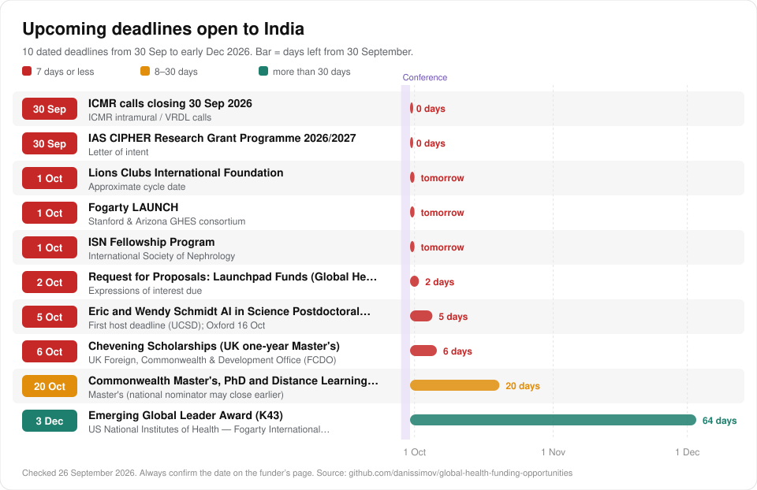

# Health research funding in India

[Back to the full list](../README.md) · [Interactive atlas](https://danissimov.github.io/global-health-funding-opportunities/)

> **Lower-middle income** · Domestic funding: **Strong** · 134 opportunities · Checked 26 September 2026

India has deep domestic funding: ICMR, ANRF, DBT and BIRAC. Wellcome funds India only through the DBT/Wellcome India Alliance. India is not automatically eligible for Horizon Europe.

## Which funder lists is India on?

| Funder rule | India |
| --- | --- |
| Wellcome, applying directly | No. Use the India Alliance |
| UK NIHR global health | Yes (South Asia) |
| EU Horizon Europe / EDCTP3 | Not automatic |
| UK Academy of Medical Sciences networking grants | Yes (stream 1) |
| Commonwealth scholarships | Yes |
| US bilateral health agreement | None found |
| Research4Life journal access | Not on the core lists |

## Best first moves

1. **[ICMR Extramural Grants: Small (ANVESHAN) and Intermediate](https://www.icmr.gov.in/post/call-for-investigator-initiated-research-proposals-for-icmr-small-extramural-grants-icmr-anveshan-extramural-grants-2026-last-date-march-16-2026-5-00-pm-ist)**. Small ICMR grants. The next call is expected December to March.
2. **[India Alliance Clinical & Public Health (CPH) Research Fellowships](https://www.indiaalliance.org/)**. Clinical and public-health fellowships. Next round February to March 2027.
3. **[Prime Minister Early Career Research Grant (PMECRG)](https://anrfonline.in/ANRF/ecrg_anrf?HomePage=New)**. Early-career grant from the national research foundation.
4. **[Academy of Medical Sciences Networking Grants (ISPF-funded)](https://acmedsci.ac.uk/grants-and-programmes/grants/networking-grants)**. Up to £25,000, led from India with a UK partner.
5. **[Biotechnology Ignition Grant (BIG)](https://birac.nic.in/big.php)**. Seed money for medical-technology and AI prototypes. Opens 1 January 2027.

## Next deadlines

| Date | Opportunity | Note |
| --- | --- | --- |
| 29 Sep 2026 | [Gates Foundation Global Grand Challenges – open RFPs](https://gcgh.grandchallenges.org/grant-opportunities) | Low-cost pathogen sequencing RFP |
| 30 Sep 2026 | [ICMR calls closing 30 Sep 2026](https://www.icmr.gov.in/post/call-for-proposals-under-icmr-intramural-research-program-2026-last-date-of-submission-september-30-2026-till-17-00-hrs) | ICMR intramural / VRDL calls |
| 30 Sep 2026 | [IAS CIPHER Research Grant Programme 2026/2027](https://www.iasociety.org/grants/cipher-grant-programme-2026-2027) | Letter of intent |
| 1 Oct 2026 | [Lions Clubs International Foundation](https://www.lionsclubs.org/en/lcif-grants-toolkit) | Approximate cycle date |
| 1 Oct 2026 | [Fogarty LAUNCH](https://www.fic.nih.gov/Programs/Pages/scholars-fellows-global-health.aspx) | Stanford & Arizona GHES consortium |
| 1 Oct 2026 | [ISN Fellowship Program](https://fellowship.theisn.org/) | Closes |
| 2 Oct 2026 | [Request for Proposals: Launchpad Funds (Global Health & Wellbeing)](https://coefficientgiving.org/funds/global-health-wellbeing-opportunities/request-for-proposals-launchpad-funds/) | Expressions of interest due |
| 5 Oct 2026 | [Eric and Wendy Schmidt AI in Science Postdoctoral Fellowship](https://schmidtaiinsciencepostdocs.ucsd.edu/) | First host deadline (UCSD); Oxford 16 Oct |
| 6 Oct 2026 | [Chevening Scholarships (UK one-year Master's)](https://www.chevening.org/scholarships/application-timeline/) | Closes |
| 20 Oct 2026 | [Commonwealth Master's, PhD and Distance Learning Scholarships](https://cscuk.fcdo.gov.uk/about-us/scholarships-and-fellowships) | Master's (national nominator may close earlier) |
| 3 Dec 2026 | [Emerging Global Leader Award (K43)](https://www.fic.nih.gov/Programs/Pages/emerging-global-leader.aspx) | Closes |

## National and domestic funders

Full details, because these are the most likely first grants.

#### [ICMR Extramural Grants: Small (ANVESHAN) and Intermediate](https://www.icmr.gov.in/post/call-for-investigator-initiated-research-proposals-for-icmr-small-extramural-grants-icmr-anveshan-extramural-grants-2026-last-date-march-16-2026-5-00-pm-ist)

*Indian Council of Medical Research (ICMR), Dept of Health Research, MoHFW* · Small: INR 10 lakh to <2 crore (~USD 11k-230k) · Small up to 3 yrs; Intermediate up to 4 yrs  
`best fit`

- **What it funds:** Investigator-initiated biomedical, clinical, public-health and implementation research (discovery, development, delivery and descriptive research types).
- **Who can apply:** Scientists/faculty at Indian medical colleges, universities, research institutes and hospitals with institutional endorsement; clinicians at government medical colleges are core applicants. Small tier is the realistic entry point.
- **Status on 26 September 2026:** Closed for 2026 - next annual call expected ~Dec 2026-Jan 2027 (pattern: opens late Dec, closes March). Deadline: 2026 cycle: Small opened 29 Dec 2025, closed 16 Mar 2026 (Follow-on extended to 19 Mar); Intermediate closed 20 Mar 2026; CAR-2026 closed 31 Aug 2026.
- **How to apply:** Register on ICMR e-PMS (epms.icmr.org.in); prepare proposal now and get institutional head endorsement before the Dec/Jan call opens.

#### [ICMR-NMC Joint Call: Research for Strengthening and Enhancing Quality of Medical Education](https://www.icmr.gov.in/post/call-for-proposals-research-for-strengthening-and-enhancing-quality-of-medical-education-a-joint-initiative-of-icmr-and-nmc-2026-last-date-august-21-2026-5-00-pm)

*ICMR and National Medical Commission (NMC)*  
`best fit`

- **What it funds:** Research by medical-college faculty on medical education quality, curriculum, assessment and training.
- **Who can apply:** Aimed at faculty of NMC-recognised medical colleges; good for clinician-educators without a big lab.
- **Status on 26 September 2026:** Closed - watch for a 2027 repeat. Deadline: 2026 call closed 21 Aug 2026, 5 PM.
- **How to apply:** Monitor ICMR call page; submission via ICMR e-PMS.

#### [India Alliance Clinical & Public Health (CPH) Research Fellowships](https://www.indiaalliance.org/)

*DBT/Wellcome Trust India Alliance* · Typically 3-5 years (verify per scheme)  
`best fit`

- **What it funds:** Personal fellowships (salary + research costs) for clinicians and public-health researchers to lead their own research.
- **Who can apply:** Early Career: final-year MD/MS/MPH/PhD or up to 4 yrs post-qualification experience; Intermediate: 4-7 yrs. Must be based at an Indian host institution. Nurses/allied health with research degrees can be eligible.
- **Status on 26 September 2026:** Closed - next CPH round expected ~Feb-Mar 2027. Deadline: 2026 CPH round: applications 20 Feb - 23 Mar 2026.
- **How to apply:** Register on India Alliance IASys portal; contact potential host/mentor now.

#### [Prime Minister Early Career Research Grant (PMECRG)](https://anrfonline.in/ANRF/ecrg_anrf?HomePage=New)

*Anusandhan National Research Foundation (ANRF, successor to SERB)* · Up to INR 60 lakh + overheads (~USD 68k) · 3 years  
`best fit`

- **What it funds:** Start-up research grants for researchers newly appointed to regular academic/research posts, across all sciences including medicine.
- **Who can apply:** PhD in science/engineering OR MD/MS/MDS/MVSc; joined current institution on/after 1 Feb 2023; regular position in recognised academic/R&D institution; age <=42 (+3 yrs for SC/ST/OBC/PwD/women). Young medical-college faculty qualify.
- **Status on 26 September 2026:** Expected - check anrfonline.in for the next PMECRG window. Deadline: Per ANRF call schedule (notified on anrfonline.in); ARG 2026 pre-proposals closed 10 Jun 2026.
- **How to apply:** Create account on anrfonline.in; prepare 3-year plan and institutional endorsement.

#### [ICMR calls closing 30 Sep 2026](https://www.icmr.gov.in/post/call-for-proposals-under-icmr-intramural-research-program-2026-last-date-of-submission-september-30-2026-till-17-00-hrs)

*ICMR*

- **What it funds:** Intramural and Ignition grants for ICMR-institute scientists; VRDL call funds setting up Viral Research and Diagnostic Laboratories in medical colleges/hospitals; SARANSH-3 funds regional systematic-review workshops.
- **Who can apply:** Intramural/Ignition: ICMR institute staff only. VRDL: medical colleges/hospitals (institutional application). SARANSH-3: institutions hosting systematic-review capacity building.
- **Status on 26 September 2026:** Open - closes 30 Sep 2026 (days after the conference); mention as 'next cycle' for most attendees. Deadline: 30 Sep 2026, 17:00 IST.
- **How to apply:** Read call documents on ICMR call-for-proposals page; institutional submission.

#### [Corporate Social Responsibility](https://www.mca.gov.in/)

*Indian companies meeting CSR thresholds (via their CSR foundations)* · Usually 1 year, renewable

- **What it funds:** Schedule VII permits CSR spend on healthcare/preventive health (item i) and on contributions to research in science, technology, engineering and medicine at publicly funded universities, national labs and autonomous bodies under ICMR/DBT/DST etc. (item ix).
- **Who can apply:** Implementing agencies need CSR-1 registration; public medical colleges and ICMR/DBT institutes can receive research funds under item (ix). Individual clinicians apply via their institution or a registered NGO partner.
- **Status on 26 September 2026:** Rolling. Deadline: Rolling; most companies fix budgets April-June for the financial year.
- **How to apply:** Ensure your institution/NGO partner has CSR-1 registration; target companies with a health footprint near your district; pitch a 2-page concept before budget season.

#### [Biotechnology Ignition Grant (BIG)](https://birac.nic.in/big.php)

*BIRAC (Dept of Biotechnology)* · Up to INR 50 lakh (~USD 57k) · Up to 18 months  
`AI`

- **What it funds:** Proof-of-concept funding for early-stage biotech/medtech/health-tech innovations with commercial potential (devices, diagnostics, digital health).
- **Who can apply:** Indian startups (company/LLP incorporated on/after 1 Nov 2020) or individual innovators; clinicians can apply as innovators and later incorporate. Milestone-based, with mentoring by BIG Partners.
- **Status on 26 September 2026:** Expected - next call 1 Jan 2027. Deadline: Calls announced 1 Jan and 1 Jul each year, open ~45 days.
- **How to apply:** Online at birac.nic.in; approach a BIG Partner incubator near you for pre-submission mentoring.

#### [DHR Grant-in-Aid Scheme for Inter-Sectoral Convergence & Coordination for Health Research](https://dhr.gov.in/schemes/grant-aid-scheme-inter-sectoral-convergence-coordination-promotion-and-guidance-health)

*Department of Health Research (DHR), MoHFW*

- **What it funds:** Collaborative and implementation research that translates health leads into deliverables, involving government agencies, NGOs and industry (NCDs, mental health, RCH, infectious disease, health services).
- **Who can apply:** Researchers at medical colleges, research institutes, NGOs with collaborative design; emphasis on implementation research.
- **Status on 26 September 2026:** Uncertain - check schemes.dhr.gov.in for open windows. Deadline: Per DHR notifications.
- **How to apply:** Register on DHR e-PMS (schemes.dhr.gov.in); queries to gia.dhr.pmiu@gmail.com.

#### [IndiaAI Mission health-AI challenges](https://www.indiaai.gov.in/article/indiaai-innovation-challenge-2026)

*IndiaAI Mission (MeitY) with Ministry of AYUSH, National Cancer Grid* · Up to 2 years (Innovation Challenge)  
`AI`

- **What it funds:** Deployment-ready AI solutions for public-health delivery; CATCH supports joint proposals from AI innovators and clinical institutions to develop/validate AI across the cancer care continuum.
- **Who can apply:** Mainly startups/companies; CATCH explicitly pairs AI teams with clinical institutions - hospital clinicians can join as clinical partners.
- **Status on 26 September 2026:** Uncertain - challenge-based, periodic; monitor indiaai.gov.in. Deadline: Innovation Challenge 2026 closed 22 Feb 2026; CATCH timeline not confirmed.
- **How to apply:** Watch indiaai.gov.in announcements; for CATCH, partner via your NCG member hospital.

## International funders open to India

Grouped by type. Open the link for the full call. The same entries, with more detail, are in the [data files](../data/).

### Regional bodies and development banks

- [TDR Impact Grants](https://tdr.who.int/home/our-work/global-engagement/tdr-small-research-grants-scheme) - `best fit` *TDR with WHO regional offices.* Small implementation-research grants on infectious diseases of poverty tied to each region's priorities (e.g., WPRO 2025-26: reaching the unreached with a communicable-disease focus; EURO 2025: TB/HIV co-infection, parasitic… US$10,000-15,000 per grant (WPRO 2025-26 and EURO 2025: up to US$15,000). *Closed now; next round expected.*
- [Marie Sklodowska-Curie Actions (MSCA)](https://marie-sklodowska-curie-actions.ec.europa.eu/) - *European Commission.* Postdoctoral Fellowships (European or Global, any discipline) and Staff Exchanges that fund short secondments of staff between partner organisations, including with non-EU countries. PF: unit-cost based living/mobility allowances (2026 call budget EUR 399m, ~1,600 fellowships). *Closed now; next round expected.*

### Multilateral and global health initiatives

- [IAEA Coordinated Research Projects (CRPs)](https://www.iaea.org/services/coordinated-research-activities/how-to-participate) - `best fit` `AI` *International Atomic Energy Agency.* Institutions join multi-country CRPs; developing-country institutes receive research contracts to run their part of the protocol (e.g., AI-assisted contouring in radiotherapy, CT-based prostate contouring with an AI tool… Modest contract support. *Open all year.*
- [CEPI Calls for Proposals (epidemic/pandemic vaccines and enabling science)](https://cepi.net/calls-for-proposals/) - `AI` *Coalition for Epidemic Preparedness Innovations.* Vaccine R&D, manufacturing, and enabling science including epidemiology, modelling, immunology and AI for priority pathogens and Disease X; outbreak-response calls (e.g., Bundibugyo virus in DRC and Uganda, 2026). *Open all year.*
- [IAEA Technical Cooperation (TC) Programme](https://www.iaea.org/services/technical-cooperation-programme/how-it-works) - *International Atomic Energy Agency.* Capacity building where nuclear techniques add value: radiotherapy and nuclear medicine services, medical physics, diagnostic imaging QA, nutrition isotope techniques; delivered as equipment, expert missions, training courses… In-kind (equipment, training, fellowships). *Open all year.*
- [ICGEB Research Grants](https://www.icgeb.org/grants/) - *International Centre for Genetic Engineering and Biotechnology.* Original research in basic life sciences, human healthcare and biotechnology addressing problems relevant to the host country, with a mandatory international collaboration and training component. Up to EUR 25,000 per year (consumables, small equipment <EUR 10,000, training, limited travel). *Closed now; next round expected.*
- [UNICEF Venture Fund (frontier tech incl. AI for child health; Climate Ventures 2026)](https://www.unicef.org/innovation/venturefund) - `AI` *UNICEF Office of Innovation.* Equity-free investments in early-stage, open-source frontier-tech solutions (AI/ML, data science, blockchain, drones, XR) for children's health, nutrition, mental health and climate-health (early warning, disease forecasting… Up to US$100,000 equity-free. *Closed now; next round expected.*
- [Global Fund Grant Cycle 8 (2026-2028) country grants](https://www.theglobalfund.org/en/news/2026/2026-02-18-global-fund-board-welcomes-final-eighth-replenishment-outcome/) - *The Global Fund to Fight AIDS.* Country grants to national programmes; operational research, program evaluation and surveys can be budgeted in grants (typically under M&E/RSSH), and PRs/sub-recipients sometimes contract local researchers. *Status not confirmed.*
- [Stop TB Partnership](https://www.stoptb.org/what-we-do/accelerate-tb-innovations/tb-reach/waves-funding/wave-11) - Rapid, innovative projects to find and treat people with TB and test new delivery approaches (Wave 11: integrating TB and lung health at primary/community level; Wave 11 Plus: near-point-of-care TB tests in routine conditions)… Wave 11: up to US$550,000 per grant (28 projects, US$14.5m, 15 countries approved June 2024). *Status not confirmed.*
- [WHO headquarters, regional and country office commissioned research](https://www.who.int) - *World Health Organization.* Specific studies, evidence reviews, surveys and evaluations that WHO offices contract out to local institutions and researchers to inform guidelines and national programmes. *Status not confirmed.*
- [WHO-hosted research partnerships: Alliance for Health Policy and Systems Research](https://ahpsr.who.int/) - *WHO-hosted partnerships.* AHPSR commissions health policy and systems research through targeted requests for proposals; HRP supports SRHR research and research-capacity strengthening through its HRP Alliance hubs and ad-hoc small grants. *Status not confirmed.*

### Foreign governments and research councils

- [Emerging Global Leader Award (K43)](https://www.fic.nih.gov/Programs/Pages/emerging-global-leader.aspx) - `best fit` *US National Institutes of Health.* Mentored research career-development award for early-career scientists holding a faculty or research post at an LMIC institution. Up to US$100,000/yr salary. *Open, closes 3 Dec 2026.*
- [Dissemination and Implementation Research in Health](https://grants.nih.gov/grants/guide/pa-files/PAR-25-233.html) - `best fit` *US NIH.* Small and exploratory studies on how to spread, adopt, implement and sustain evidence-based health interventions in real-world clinical and public-health settings. NIH standard: R03 up to US$50,000/yr direct for 2 yrs. *Open.*
- [Academy of Medical Sciences Networking Grants (ISPF-funded)](https://acmedsci.ac.uk/grants-and-programmes/grants/networking-grants) - `best fit` Small grants for networking and collaboration between an overseas lead researcher and a UK co-applicant: workshops, travel and pilot data. Up to £25,000. *Closed now; next round expected.*
- [NIHR Global Advanced Fellowship (and NIHR Global Research Professorship)](https://www.nihr.ac.uk/career-development/research-career-funding-programmes/postdoctoral/global-advanced-fellowship) - `best fit` *UK NIHR.* Postdoctoral fellowships for researchers based in eligible LMICs to lead applied global health research, training and capacity strengthening. *Closed now; next round expected.*
- [CDC Global Health Center](https://www.cdc.gov/global-health/) - *US Centers for Disease Control and Prevention.* Global health security, polio and measles, HIV/TB and field epidemiology (FETP) support, mainly through cooperative agreements with ministries of health, public-health institutes and universities. FY2027 request US$663.8m for the Center for Global Health (flat). *Open.*
- [Global-health funding across other NIH Institutes](https://www.fic.nih.gov/Funding/Pages/NIH-funding-opportunities.aspx) - *US National Institutes of Health.* Investigator-initiated and targeted research on HIV, TB, malaria, cancer, mental health, cardiometabolic disease and other conditions, including studies at LMIC sites. *Open.*
- [IDRC (International Development Research Centre)](https://idrc-crdi.ca/en/funding) - `AI` Research by Global South institutions on health systems, sexual and reproductive health, climate and health, and AI. *Open.*
- [Digital Health Technology and Reciprocal Innovation program](https://www.fic.nih.gov/About/Advisory/Pages/funding-concepts.aspx) - `AI` *US NIH.* Proposed program for developing, validating, implementing and evaluating digital health tools — mHealth, AI/ML, digital diagnostics, telehealth, clinical decision support — for low-resource settings in LMICs and underserved US… *Closed now; next round expected.*
- [Fogarty Research Training Programs (D43)](https://www.fic.nih.gov/Programs/Pages/default.aspx) - *US NIH.* Institutional research-training grants that build a cadre of LMIC researchers through degree and non-degree training, mentoring and small research projects. *Closed now; next round expected.*
- [GACD 11th joint call](https://cihr-irsc.gc.ca/e/54557.html) - *Canadian Institutes of Health Research.* Implementation research on NCD prevention, screening and continuity of care, using settings and sectors beyond the formal health system (communities, NGOs, faith-based groups) in LMICs and underserved high-income-country… CIHR: up to CA$200,000/yr, max CA$1,000,000 per grant. *Closed now; next round expected.*
- [Grand Challenges Canada](https://www.grandchallenges.ca/apply-for-funding/) - Innovation grants for 'bold ideas with big impact': Proof of Concept and Transition to Scale funding for locally led health innovations. *Closed now; next round expected.*
- [NIHR Global Health Research (GHR) Themed Programme 2026](https://www.nihr.ac.uk/global-health/funding-programmes/ghr-themed) - *UK National Institute for Health and Care Research.* Applied health research — including later-stage trials and implementation research — on antimicrobial stewardship, preventing AMR infections and improving AMR-related outcomes for WHO-priority bacterial and fungal pathogens. £500,000–£5m overall. *Closed now; next round expected.*
- [Research Council of Norway](https://www.forskningsradet.no/en/call-for-proposals/2026/researcher-project-for-early-career-scientists-on-global-health-and-development-research/) - Early-career-led research on health inequalities, health security, poverty and development, with equitable joint leadership by partners in low- and lower-middle-income countries. NOK 4–10 million per project (NOK 120m pot in 2026). *Closed now; next round expected.*
- [Solution-oriented Research for Development (SOR4D)](https://www.snf.ch/en/Fb19rz5iYXpbuPyy/funding/programmes/sor4d-programme) - *Swiss National Science Foundation.* Transdisciplinary, solution-oriented research by mixed consortia (Swiss researchers + ODA-country researchers + non-academic practice partners) on the SDGs, including human development and health. CHF 22.4 million total for Phase 2 (per-project amount in the call document). *Closed now; next round expected.*
- [Germany — BMFTR (formerly BMBF) global health programmes, DFG international cooperation, DAAD scholarships, Else Kröner-Fresenius-Stiftung, GIZ](https://www.daad.de/en/studying-in-germany/scholarships/) - BMFTR: research networks and product development for neglected and poverty-related diseases, mainly with African partners. *Status not confirmed.*
- [Global Brain and Nervous System Disorders Research Across the Lifespan](https://www.fic.nih.gov/Programs/Pages/brain-disorders.aspx) - *US NIH.* Collaborative research on nervous-system development, function and disorders (neurological, mental health, substance use) relevant to LMICs across the life course. R21: NIH standard is up to US$275,000 direct over 2 years (confirm in the NOFO). *Status not confirmed.*
- [SATREPS — Science and Technology Research Partnership for Sustainable Development](https://www.jst.go.jp/global/english/) - *Japan Agency for Medical Research and Development.* Joint Japan–ODA-country research projects. *Status not confirmed.*
- [Sida research cooperation (and Swedish Research Council development research)](https://www.sida.se/en/for-partners/research-partners) - *Swedish International Development Cooperation Agency.* Sida builds national research systems through bilateral university partnerships ('sandwich' PhDs) in Bolivia, Cambodia, Ethiopia, Mozambique, Rwanda and Tanzania, and funds global partners (EDCTP, TDR, the Alliance for Health… *Status not confirmed.*
- [UKRI Medical Research Council (MRC)](https://www.ukri.org/what-we-do/browse-our-areas-of-investment-and-support/applied-global-health/) - *UK Research and Innovation.* Previously applied global health research and partnerships (Applied Global Health Research, Applied Global Health Partnership). *Paused.*

### Foundations and charities

- [IAS CIPHER Research Grant Programme 2026/2027](https://www.iasociety.org/grants/cipher-grant-programme-2026-2027) - `best fit` *International AIDS Society.* Early-stage investigators addressing paediatric and adolescent HIV research gaps; 2026 focus: prevention of vertical transmission, adolescent HIV prevention, co-morbidities (cardiometabolic, hepatitis, TB). Up to USD 140,000. *Open. 30 Sep 2026: Letter of intent.*
- [DIV Fund Request for Proposals](https://www.div.fund/apply/rfp) - `best fit` Piloting, rigorously testing and scaling cost-effective innovations for people in poverty in any sector — health delivery, products, policies — plus evidence generation for widely used but unevaluated approaches. Stage 1 up to US$200k. *Open all year.*
- [Strep A Vaccine Fund](https://coefficientgiving.org/funds/strep-a-vaccine-fund/open-call/) - `best fit` *Coefficient Giving.* Projects across the Strep A vaccine pipeline with a plausible link to preventing rheumatic heart disease: Phase 1 and controlled human infection trials, epidemiology/immunology to inform trial endpoints, preclinical models and… *Open all year.*
- [Conquer Cancer International Innovation Grant (IIG)](https://www.asco.org/career-development/grants-awards/funding-opportunities/international-innovation-grant) - `best fit` Novel, hypothesis-driven cancer control projects in LMICs with potential to reduce local cancer burden and transfer to other LMIC settings. Up to USD 20,000 (two instalments). *Closed now; next round expected.*
- [ISN Clinical Research Program](https://www.theisn.org/in-action/grants/isn-clinical-research/) - `best fit` *International Society of Nephrology.* Research and education projects detecting/managing CKD, AKI, hypertension, diabetes and cardiovascular disease, involving nephrologists, health workers and local authorities; plus a scientific writing course. *Closed now; next round expected.*
- [ReGRoW — Repurposing Grants for the Rest of the World](https://www.cureswithinreach.org/programs/regrow-pilot/) - `best fit` *Cures Within Reach.* Proof-of-concept clinical trials in LICs/LMICs repurposing generic or off-patent drugs, nutraceuticals or indigenous medicines for local unmet needs (any disease area; preference for high burden). Up to US$70,000 (budgets ≤$60k, or larger with co-funding). *Closed now; next round expected.*
- [Request for Proposals: Generic Drug Repurposing](https://coefficientgiving.org/funds/science-and-global-health-rd/request-for-proposals-generic-drug-repurposing/) - `best fit` *Coefficient Giving.* Late-stage (Phase IIc/III) clinical trials testing off-patent generics, nutraceuticals, indigenous medicines or vaccines in new indications for high-burden, neglected diseases, aimed at patients in low- and lower-middle-income… Up to US$20m total budget. *Closed now; next round expected.*
- [Request for Proposals: Global Health and Wellbeing in an Era of Transformative AI](https://coefficientgiving.org/funds/global-health-wellbeing-opportunities/request-for-proposals-global-health-and-wellbeing-in-an-era-of-transformative-ai/) - `best fit` `AI` *Coefficient Giving.* Research, policy development, field-building and implementation on how transformative AI will change health and economic outcomes, especially for the global poor (e.g. US$10–30m total. *Closed now; next round expected.*
- [Research on Global Lead Poisoning](https://www.cgdev.org/blog/momentum-tackling-global-lead-poisoning-continues-grow-theres-still-much-we-dont-know-so-were) - `best fit` *Center for Global Development with Coefficient Giving.* Research on lead exposure in LMICs: measurement and monitoring tools (e.g. blood lead), source identification, used lead-acid battery recycling, and policy effectiveness; fieldwork or desk research, RCTs to environmental sampling. Up to US$5m total. *Closed now; next round expected.*
- [Thrasher Research Fund Early Career Award (and E.W. 'Al' Thrasher Award)](https://www.thrasherresearch.org/early-career-award?lang=eng) - `best fit` Small grants for new child-health researchers (mostly development-stage clinical research, some implementation science) working with a mentor. Up to USD 25,000 direct + 7% indirect (max USD 26,750). *Closed now; next round expected.*
- [Rotary Foundation Global Grants and District Grants](https://www.rotary.org/get-involved/our-programs/grants) - `best fit` Humanitarian projects, vocational training teams and graduate scholarships in Rotary areas of focus, including disease prevention and treatment and maternal and child health. Global grant budgets: minimum USD 30,000, maximum USD 400,000 (per 2026 guides). *By invitation or through a local network.*
- [ISID Research Capacity Building Grants](https://isid.org/research/isid-research-capacity-building-grants/) - `best fit` *International Society for Infectious Diseases.* Seed grants plus mentorship for early-career infectious disease/AMR/IPC/epidemiology researchers in low- and lower-middle-income countries; funding to present results at an ISID event. *Paused.*
- [RSTMH Early Career Grants Programme](https://www.rstmh.org/grants) - `best fit` *Royal Society of Tropical Medicine and Hygiene.* First grants for people who have not held equivalent research funding in their own name; any area of tropical medicine or global health (lab, clinical, implementation, policy). Up to GBP 5,000. *Paused.*
- [Request for Proposals: Launchpad Funds (Global Health & Wellbeing)](https://coefficientgiving.org/funds/global-health-wellbeing-opportunities/request-for-proposals-launchpad-funds/) - *Coefficient Giving.* Pre-seed and seed/scaling money for new or scalable outcome-oriented 'funds' (regrantors or implementers owning a whole problem) in global health and wellbeing that could grow to deploy $100m+. Pre-seed US$200k–10m. *Open. 2 Oct 2026: Expressions of interest due.*
- [Keystone Symposia Global Health Awards](https://www.keystonesymposia.org/financial-aid/global-health-awards) - Travel awards covering registration, lodging, airfare (and ground transport at some venues) for LMIC scientists and clinicians to attend selected 2027 Keystone conferences. Full conference costs (in-kind: registration, lodging, airfare). *Open.*
- [Mulago Fellowship (Rainer Arnhold Fellows)](https://www.mulagofoundation.org/our-fellowships) - *Mulago Foundation.* One-year fellowship for founders/leaders of organisations with scalable solutions to poverty — primary health care, maternal/newborn care, vaccination, malaria, family planning, mental wellbeing, WASH; route to Mulago's long-term… Fellowships page says US$200k (How We Fund page still says US$100K). *Open.*
- [Azim Premji Foundation Grants](https://azimpremjifoundation.org/who-we-are/how-we-are-organised/grants/) - Grants to Indian civil society organisations of all sizes, including health-adjacent areas (disability & mental health, children, gender justice); priority states include Andhra Pradesh, Bihar, Eastern UP, Northeast, Odisha… From a few lakh rupees to a few tens of crores. *Open all year.*
- [Draper Richards Kaplan Foundation](https://www.drkfoundation.org/apply/overview/) - Early-stage (post-pilot, seed to Series A) nonprofits and mission-driven companies with scalable solutions for underserved communities, including health. Up to US$300,000 over 3 years (plus up to ~US$500k in-kind support). *Open all year.*
- [GiveWell grants](https://www.givewell.org/apply-for-consideration) - Highly cost-effective programs and research in malaria, vaccines, nutrition/anemia, water, livelihoods and 'new areas' (e.g. medicine supply chains, oxygen devices, newborn care studies in India). Not fixed — from small research grants to very large program grants. *Open all year.*
- [Novo Nordisk Foundation – global health funding](https://novonordiskfonden.dk/en/how-we-work/unsolicited-inquiries/) - Health, life-science and global-health projects. *Open all year.*
- [Science and Global Health R&D Fund](https://coefficientgiving.org/funds/science-and-global-health-rd/our-funding-criteria/) - *Coefficient Giving.* Neglected, high-DALY biomedical and global-health R&D (vaccines, diagnostics, therapeutics, market shaping, e.g. malaria vaccine trials, sickle-cell diagnostics, protein design). *Open all year.*
- [Gates Foundation Global Grand Challenges – open RFPs](https://gcgh.grandchallenges.org/grant-opportunities) - Topic-specific requests for proposals (RFPs) on global health and development problems. Sequencing RFP: Tier 1 up to US$300,000. *Closed now; next round expected. 29 Sep 2026: Low-cost pathogen sequencing RFP.*
- [Aga Khan Foundation International Scholarship Programme](https://the.akdn/en/what-we-do/developing-human-capacity/education/international-scholarships) - Postgraduate study (mainly master's) for outstanding students from selected developing countries with no other means of financing. Tuition and living expenses. *Closed now; next round expected.*
- [Bloomberg Initiative to Reduce Tobacco Use – Tobacco Control Grants Program](https://www.tobaccocontrolgrants.org/) - *Bloomberg Philanthropies.* Policy-change projects on MPOWER measures (tax, smoke-free laws, advertising bans, graphic warnings, FCTC Article 5.3). Tobacco control: US$25,000–250,000 per year. Cessation: up to US$400,000. *Closed now; next round expected.*
- [Evidence for AI in Health (EVAH) RFP](https://www.povertyactionlab.org/initiative/evidence-ai-health-evah-initiative) - `AI` *Gates Foundation.* Locally led evaluations of AI-enabled clinical decision-support tools (triage, diagnosis, referral) used by frontline workers in primary and community care. Pathway A up to US$1,000,000. Pathway B up to US$3,000,000. The joint initiative totals US$60M. *Closed now; next round expected.*
- [Gates Foundation AI calls and the US$1B equitable-AI commitment](https://www.gatesfoundation.org/ideas/media-center/press-releases/2026/09/goalkeepers-report-equitable-ai) - `AI` AI-for-health work in LMICs: Grand Challenges AI RFPs, co-funded evaluations (EVAH) and, from Sep 2026, a pledge of at least US$1B over two years for equitable AI. *Closed now; next round expected.*
- [Grand Challenges India (GCI)](https://www.birac.nic.in/grandchallengesindia/) - *BIRAC / Department of Biotechnology.* India-specific Grand Challenges calls in health, nutrition, agriculture and AI. Screening & Diagnosis 2026: INR 50 lakh to INR 2 crore depending on stage. *Closed now; next round expected.*
- [J-PAL research initiatives (K-CAI, IGI, GiveWell-funded Risk Valuation Top-Up Fund)](https://www.povertyactionlab.org/initiative/requests-proposals) - Randomised evaluations and scale-up in LMICs; K-CAI covers climate/pollution with health co-benefits; the Risk Valuation (VSL) Top-Up Fund funds LMIC value-of-statistical-life estimates; IGI funds government-embedded evaluations. *Closed now; next round expected.*
- [Nexa Lighthouse (Asia-Pacific climate x health)](https://www.grandchallenges.ca/portfolio/nexa-lighthouse/) - *Grand Challenges Canada with AVPN.* Growth-stage climate x health innovations in Asia and the Pacific addressing vector-borne disease, extreme heat and air quality. *Closed now; next round expected.*
- [UICC Technical Fellowships](https://www.uicc.org/what-we-do/member-benefits/learning-and-development/fellowships/technical-fellowships) - *Union for International Cancer Control.* Short-term training visits for cancer professionals to acquire specific skills at a host institution abroad (clinical, research, programme management). *Closed now; next round expected.*
- [Wellcome Leap programs](https://wellcomeleap.org/) - DARPA-style, milestone-driven programs of about US$50M each on specific health breakthroughs, e.g. Program totals about US$50–55M. Per-project amounts vary. *Closed now; next round expected.*
- [India-based philanthropies and AI institutes](https://www.tatatrusts.org/) - `AI` *Various.* Tata Trusts: health (cancer care, nutrition, mental health, data-driven governance). *Status not confirmed.*
- [Rockefeller Foundation Bellagio Center – Residencies and Convenings](https://www.rockefellerfoundation.org/fellowships-convenings/bellagio-center/residency-program/) - In-kind support. In-kind: room, board and studio. *Status not confirmed.*
- [Lions Clubs International Foundation](https://www.lionsclubs.org/en/lcif-grants-toolkit) - Lions-led service projects: diabetes screening/camps/workforce training/equipment; childhood cancer care infrastructure with hospitals; vision/blindness prevention. USD 10,000-300,000 depending on grant type. *By invitation or through a local network. 1 Oct 2026: Approximate cycle date.*
- [Global Innovation Fund (GIF)](https://www.globalinnovation.fund/apply-for-funding) - Tiered funding for social innovations improving lives of people on low incomes, including health. About US$50k to US$15m depending on stage. *Paused.*

### Corporate and tech, including AI

- [Claude for Nonprofits (discounted Team/Enterprise; LMIC tier)](https://claude.com/solutions/nonprofits) - `best fit` `AI` *Anthropic.* Discounted Claude Team/Enterprise plans for verified nonprofits, including Claude and Claude Code, nonprofit connectors (Benevity, Blackbaud, Candid) and a free AI Fluency for Nonprofits course. Team: US$8/user/month. *Open.*
- [Claude Team plan for scientists (free Standard seats)](https://claude.com/programs/team-plan-for-scientists) - `best fit` `AI` *Anthropic.* Promotional Claude Team plan for verified research groups: Standard seats free and Premium seats heavily discounted, including Claude Science, Claude Code, Cowork, research-database connectors and shared projects. Standard seat US$0/month (regularly US$20). *Open.*
- [AI for Science Program (API credits)](https://support.claude.com/en/articles/11199177-anthropic-s-ai-for-science-program) - `best fit` `AI` *Anthropic.* Free Claude API credits for researchers at academic and nonprofit research institutions applying generative AI to high-priority science, with a focus on biology/life sciences; medicine/healthcare is an explicitly listed field. Up to US$20,000 in API credits (standard track). *Open all year.*
- [AWS Cloud Credit for Research (and status of AWS Health Equity Initiative)](https://aws.amazon.com/government-education/research-and-technical-computing/cloud-credit-for-research/) - `AI` *Amazon Web Services.* AWS promotional credits for research workloads, science-as-a-service tools and training (can include Amazon Bedrock generative AI). Faculty/staff awards not capped. *Open.*
- [ChatGPT Edu (institutional licenses) incl. OpenAI for India licenses](https://chatgpt.com/business/education/) - `AI` University-wide ChatGPT licenses for students, faculty and staff. Pricing not published. *Open.*
- [Claude for Education (higher education plans)](https://claude.com/solutions/education) - `AI` *Anthropic.* University-wide Claude plans for students, faculty and staff (learning mode, Claude Code, Claude Science, Claude for Word) plus free AI Fluency courses. *Open.*
- [Cohere Labs Catalyst Grants](https://cohere.com/research/grants) - `AI` Free Cohere API credits (Command, Aya multilingual, Embed, etc.) for academic, civic and public-impact projects; healthcare and multilingual work are explicit focus areas. *Open.*
- [Gemini for Education (Google Workspace for Education)](https://edu.google.com/intl/ALL_us/ai/gemini-for-education/) - `AI` *Google for Education.* No-cost Gemini app and NotebookLM with education data protections for institutions on Google Workspace for Education (Fundamentals is free); select Gemini-in-Workspace features added to core editions at no extra cost from 2026… Free (Education Fundamentals). *Open.*
- [GitHub Education](https://github.com/education/students) - `AI` Free GitHub Copilot (AI coding assistant) for verified students and teachers, plus the Student Developer Pack. Copilot Pro (teachers) / Copilot Student plan free. *Open.*
- [Google AI student offer (12 months free Google AI Plus/Pro)](https://blog.google/innovation-and-ai/products/gemini-app/student-offer-google-ai/) - `AI` Free 12-month Google AI plan for college/university students: Google AI Plus outside the U.S. (Gemini with higher limits, 400 GB storage) and Google AI Pro in the U.S. 12 months of Google AI Plus. *Open.*
- [Google for Nonprofits (Workspace for Nonprofits with Gemini & NotebookLM)](https://www.google.com/nonprofits/) - `AI` No-cost Google Workspace for Nonprofits including the Gemini app and NotebookLM (with enterprise data protection) for up to 2,000 users, plus Ad Grants and other offers; discounts on higher Workspace tiers. Free for up to 2,000 users. *Open.*
- [Microsoft for Nonprofits (Azure grant, M365 & Copilot discounts)](https://www.microsoft.com/en-us/nonprofits/offers-for-nonprofits) - `AI` Annual Azure credit grant (usable for Azure OpenAI/AI services), free Microsoft 365 Business Basic with Copilot Chat, and discounted Microsoft 365 Copilot and security products for eligible nonprofits. US$2,000 Azure credits per year. *Open.*
- [OpenAI for Nonprofits (ChatGPT Business/Enterprise discount)](https://help.openai.com/en/articles/9359041-openai-for-nonprofits) - `AI` Discounted ChatGPT Business Standard seats for verified nonprofits, and up to 75% off ChatGPT Enterprise for large deployments. ChatGPT Business Standard: US$8/user/month billed annually or US$10 monthly. *Open.*
- [Pfizer Global Medical Grants (Competitive Grant RFPs) and Investigator Sponsored Research](https://www.pfizer.com/about/programs-policies/grants/competitive-grants) - Independent research, quality improvement and education projects in areas aligned with Pfizer's medical strategy via publicly posted RFPs (some global); separately, investigator-sponsored research (ISR) on Pfizer products. *Open.*
- [TechSoup Global Network (nonprofit tech donations & discounts)](https://www.techsoup.global/) - *TechSoup and donor partners.* Validation plus access to donated/discounted software, cloud and hardware for NGOs (e.g., Microsoft licenses, Windows grants up to 50 licenses, Cisco, Box); some AI-enabled products included. *Open.*
- [Google Cloud Research Credits](https://edu.google.com/programs/credits/research/) - `AI` Google Cloud credits (incl. Faculty and postdocs: one award up to US$5,000. *Open all year.*
- [Hugging Face Community GPU Grants & ZeroGPU](https://huggingface.co/docs/hub/en/spaces-gpus) - `AI` Free GPU hardware (ZeroGPU or dedicated GPU) for Hugging Face Spaces hosting academic research demos and useful open-source ML apps; ZeroGPU Spaces are free for all users (limits apply). *Open all year.*
- [OpenAI Researcher Access Program](https://openai.com/form/researcher-access-program/) - `AI` Subsidized API credits for research on responsible AI deployment, risk mitigation and societal impacts of AI (e.g., evaluating LLM safety/accuracy in clinical or public-health contexts). Up to US$1,000 in API credits. *Open all year.*
- [Pharma investigator-initiated/supported study programmes](https://iss.gsk.com/) - *Various pharmaceutical companies.* Investigator-designed studies (often observational/real-world or pragmatic) related to a company's products or disease areas; support may be funding and/or drug supply. *Open all year.*
- [AstraZeneca Young Health Programme (YHP) incl. YHP Impact Fellowship](https://www.oneyoungworld.com/scholarship/astrazeneca-young-health-programme-impact-fellowship) - Youth health equity (NCD prevention, mental health) with UNICEF and 60+ NGOs; new 2026-2030 phase. Fellowship grant USD 10,000 (USD 50,000 for the Lead2030 SDG3 winner). *Closed now; next round expected.*
- [Google.org Accelerator: Generative AI](https://impactchallenge.withgoogle.com/genaiaccelerator) - `AI` Six-month accelerator with funding, pro bono Google engineers, technical training and Google Cloud credits for nonprofits building gen-AI solutions (2025 cohort included ARMMAN's nurse-midwife copilot in India and Aga Khan… Share of US$30M across ~20 organizations (2025 cohort). *Closed now; next round expected.*
- [Meta Llama Impact Grants](https://www.llama.com/llama-ai-innovation/) - `AI` Projects using open-source Llama models for social impact (health, education, agriculture), e.g., offline multilingual medical assistance. Past round: up to USD 500,000 per recipient (USD 2M pool). *Status not confirmed.*
- [AWS Health Equity Initiative](https://aws.amazon.com/government-education/nonprofits/global-social-impact/health-equity/) - `AI` *Amazon Web Services.* AWS promotional credits and technical support for organizations building cloud/AI solutions that reduce health disparities (has supported ~230 organizations in 28 countries). Up to US$250,000 in AWS credits per application (25% match required in past rounds). *Paused.*
- [Lacuna Fund (labeled ML datasets, incl. health)](https://lacunafund.org/apply) - `AI` Creation, expansion and maintenance of locally owned, openly licensed labeled datasets for machine learning in agriculture, language, health and climate in low- and middle-income contexts. *Paused.*

### Fellowships, training and small grants

- [Fogarty LAUNCH](https://www.fic.nih.gov/Programs/Pages/scholars-fellows-global-health.aspx) - `best fit` *NIH Fogarty International Center and partner NIH institutes.* One year of mentored research training at established NIH-funded research sites in LMICs; stipend, research funds, training. *Open. 1 Oct 2026: Stanford & Arizona GHES consortium.*
- [ISN Fellowship Program](https://fellowship.theisn.org/) - `best fit` *International Society of Nephrology.* Clinical/research nephrology training abroad for physicians from low-resource regions, who return home to build kidney care. *Open, closes 1 Oct 2026.*
- [Chevening Scholarships (UK one-year Master's)](https://www.chevening.org/scholarships/application-timeline/) - `best fit` *UK Foreign, Commonwealth & Development Office.* Fully funded one-year taught Master's at any UK university (e.g., MPH, MSc Global Health, Tropical Medicine, Health Policy); leadership network. *Open, closes 6 Oct 2026.*
- [Commonwealth Master's, PhD and Distance Learning Scholarships](https://cscuk.fcdo.gov.uk/about-us/scholarships-and-fellowships) - `best fit` *Commonwealth Scholarship Commission in the UK.* Fully funded UK Master's and PhD study for citizens of low- and middle-income Commonwealth countries; Distance Learning Scholarships fund UK Master's studied from home. *Open. 20 Oct 2026: Master's (national nominator may close earlier).*
- [DAAD EPOS](https://www2.daad.de/deutschland/stipendium/datenbank/en/21148-scholarship-database/?detail=50076777) - `best fit` Master's/PhD in development-related courses in Germany, including MSc International Health (Charite Berlin, Heidelberg) and Global Health (Bonn). EUR 992/month (Master's). *Open.*
- [Fulbright Foreign Student Program and Fulbright Visiting Scholar Program](https://foreign.fulbrightonline.org/) - `best fit` *US Department of State.* Foreign Student: graduate study (MPH, MSc, PhD) in the US. *Open.*
- [IAS fellowships](https://www.iasociety.org/fellowships) - `best fit` *International AIDS Society.* Mark Wainberg: 2-year clinical HIV-management training (1 year at a clinical institution, 1 year research project). *Open.*
- [Rising Scholars (formerly AuthorAID, INASP)](https://risingscholars.net/en/) - `best fit` `AI` Free online mentoring, collaboration network, and free courses in research writing, proposal writing and AI in research. Free. *Open.*
- [Emergent Ventures (incl. India, and Africa & Caribbean tracks)](https://www.mercatus.org/emergent-ventures) - `best fit` *Mercatus Center, George Mason University.* Low-overhead fellowships and grants for individuals with scalable 'zero to one' ideas to improve society, in any field, including health and science. *Open all year.*
- [SORT IT - Structured Operational Research and Training IniTiative](https://tdr.who.int/activities/sort-it-operational-research-and-training) - `best fit` *TDR (coordinator) with implementing partners (WHO offices.* Mentored, milestone-based training in which each participant completes their own operational research project from protocol to published paper and policy brief (4 modules: protocol, data, manuscript, research communication). In-kind: tuition, mentorship and usually module travel covered by the course sponsor. *Open all year.*
- [Atlantic Fellows for Health Equity](https://healthequity.atlanticfellows.org/apply/) - `best fit` *Atlantic Philanthropies / Atlantic Institute.* Year-long, non-residential leadership fellowship with three in-person global convenings and online modules on health equity. *Closed now; next round expected.*
- [Hubert H. Humphrey Fellowship Program](https://www.humphreyfellowship.org/) - `best fit` *US Department of State.* 10 months of non-degree graduate study and professional development at a US university (Public Health and HIV/AIDS/Substance Abuse tracks are common host themes). *Closed now; next round expected.*
- [IAS conference scholarships (AIDS / IAS / HIVR4P conferences)](https://www.iasociety.org/scholarships) - `best fit` *International AIDS Society.* Registration, travel and accommodation (in-person) or virtual access to IAS conferences, plus 2 years free IAS membership. *Closed now; next round expected.*
- [Union World Conference on Lung Health scholarships](https://worldlunghealth.org/scholarships-and-sponsored-registrations/) - `best fit` *International Union Against Tuberculosis and Lung Disease.* Full scholarships (registration, travel, accommodation) for presenters from low- and lower-middle-income countries; sponsored registrations for others. *Closed now; next round expected.*
- [Field Epidemiology Training Programmes (FETP)](https://www.tephinet.org/) - `best fit` *National ministries of health with CDC.* Paid, service-based applied epidemiology training (Frontline 3 months, Intermediate ~9 months, Advanced 2 years). Salary continues. *Status not confirmed.*
- [Eric and Wendy Schmidt AI in Science Postdoctoral Fellowship](https://schmidtaiinsciencepostdocs.ucsd.edu/) - `AI` *Schmidt Sciences.* Two-year postdocs for scientists (incl. biomedical and health sciences at some hosts) to learn and apply AI methods in their field; not core CS/AI research. UC San Diego: salary from US$85,000/yr plus benefits (varies by host). *Open. 5 Oct 2026: First host deadline (UCSD); Oxford 16 Oct.*
- [EA Funds — Transformative AI Fund (replaced Long-Term Future Fund)](https://funds.effectivealtruism.org/funds/transformative-ai) - `AI` *Effective Altruism Funds.* Projects addressing global catastrophic risks, especially from advanced AI and pandemics; the Long-Term Future Fund has closed and been replaced by this fund. US$1,000–500,000 (EA Funds range). *Open all year.*
- [Experiment.com](https://experiment.com/guide/extra) - All-or-nothing crowdfunding for openly shared research projects, including medicine and public health. Set by researcher (typically small budgets). *Open all year.*
- [Manifund — open fundraising and regranting platform](https://manifund.org/about) - Public 'Kickstarter for nonprofits' proposals for charitable and research projects, funded by donors and by expert regrantors with delegated budgets; also hosts ACX Grants and impact-market rounds. *Open all year.*
- [Rotary Global Grant Scholarships and Rotary Peace Fellowships](https://www.rotary.org/en/our-programs/peace-fellowships) - *The Rotary Foundation / local Rotary districts.* Global grant scholarships fund graduate study abroad in Rotary areas of focus (incl. disease prevention and treatment; maternal and child health). *Open all year.*
- [ACX Grants](https://www.astralcodexten.com/p/acx-grants-results-2025) - *Scott Alexander.* Charitable and scientific projects that change complex systems (novel tech, institutions, policy); past grants include neglected-disease drugs, lead-battery recycling, disease prevention and biosecurity. 2025 round: US$1.5m to 42 projects, grants ~US$5k–150k. *Closed now; next round expected.*
- [ASTMH Annual Meeting Travel Awards](https://www.astmh.org/annual-meeting/awards) - *American Society of Tropical Medicine and Hygiene.* Registration, round-trip airfare and stipend for students, early-career investigators and scientists in tropical medicine (incl. Registration + airfare + stipend. *Closed now; next round expected.*
- [Charity Entrepreneurship (AIM) Incubation Program](https://www.charityentrepreneurship.com/) - Free training, co-founder matching and seed funding to launch new cost-effective charities; a Global Health and Development round focuses on large-scale health interventions. Seed US$150k–190k for ~95% of projects. *Closed now; next round expected.*
- [Commonwealth Professional Fellowships (Commonwealth Fellowship Programme)](https://cscuk.fcdo.gov.uk/scholarships/commonwealth-fellowships-information-for-candidates/) - *Commonwealth Scholarship Commission in the UK.* Short professional-development placement for mid-career professionals at a UK host organisation in their sector. *Closed now; next round expected.*
- [CUGH conference bursaries and awards](https://cughlima2027.org/) - *Consortium of Universities for Global Health.* Free registration, hotel and travel stipend for abstract presenters from low/lower-middle-income countries (reported ~10 bursaries); CUGH also runs competitions/awards. Registration + hotel + travel stipend. *Closed now; next round expected.*
- [Erasmus Mundus Joint Master scholarships (e.g., Europubhealth+)](https://www.europubhealth.org/application-procedure/) - *European Commission.* Two-year joint Master's across several European universities; public health options include Europubhealth+ and other health programmes in the EMJM catalogue. Tuition, travel, insurance and EUR 1,400/month. *Closed now; next round expected.*
- [IARC Postdoctoral Fellowships and Return Grants (cancer research)](https://training.iarc.who.int/postdoctoral-fellowships-intro/) - *International Agency for Research on Cancer.* Two-year postdoctoral training at IARC (Lyon) in cancer epidemiology, prevention and related fields, with an optional return grant to start research at home. 2025 call: stipend EUR 2,950/month net plus travel. *Closed now; next round expected.*
- [Japanese Government (MEXT) Scholarship](https://www.studyinjapan.go.jp/en/smap-stopj-applications-research.html) - *Japan Ministry of Education.* Master's/PhD or non-degree research at Japanese universities, including medicine and public health. *Closed now; next round expected.*
- [TDR Implementation Research Leadership Fellowship Programme for Public Health Impact](https://tdr.who.int/docs/librariesprovider10/calls-for-applications/ir-leadership-fellowship-call-for-applications-december-2026.pdf) - *TDR, hosted by Universitas Gadjah Mada.* Six-month in-person leadership fellowship in implementation research, with two streams: academics/researchers (lead an IR project at home institution) and public-health practitioners in managerial roles (integrate IR into a… Fully funded: return airfare, monthly stipend, insurance, IR project expenses incl.…. *Closed now; next round expected.*
- [TDR Postgraduate Training Scheme](https://tdr.who.int/grants) - *TDR via regional training centres.* Full scholarships for master's degrees with an implementation-research focus at TDR-supported universities in LMICs, including a research project relevant to the scholar's home programme. Full scholarship (tuition, stipend, travel) - exact value varies by host. *Closed now; next round expected.*
- [World Federation of Neurology grants-in-aid and Junior Travelling Fellowships](https://wfneurology.org/activities/education-grants-and-awards) - Educational grants-in-aid (education/patient-education projects), Junior Travelling Fellowships to meetings, department visits/observerships. *Closed now; next round expected.*
- [ASCO IDEA and ESMO Fellowships (oncology)](https://www.asco.org/career-development/grants-awards/funding-opportunities/international-development-education-award) - *ASCO / Conquer Cancer.* ASCO IDEA: travel to ASCO Annual Meeting plus mentorship and US cancer-centre visit for early-career oncologists from LMICs (incl. palliative-care track). *Status not confirmed.*
- [Aspen Institute New Voices Fellowship](https://www.aspenglobalinnovators.org/en/programs/new-voices-fellowship/) - Communications, advocacy and op-ed/media training for development and health experts from Africa, Asia, Latin America & Caribbean. *Status not confirmed.*
- [TDR Clinical Research Leadership (CRL) Fellowship](https://tdr.who.int/grants) - *TDR with pharmaceutical companies and product-development partnerships as hosts.* Placement of LMIC researchers in industry/PDP clinical-development teams to gain skills in trial design, conduct, regulatory and GCP, then return to lead trials at home. *Status not confirmed.*

### Humanitarian and implementation

- [Elrha Humanitarian Innovation Fund (HIF)](https://www.elrha.org/innovation) - `AI` Innovation challenges in humanitarian response (e.g., GBV tech, inclusion data, scaling, AI for humanitarians). *Closed now; next round expected.*
- [Elrha R2HC](https://www.elrha.org/funding-opportunities/r2hc-annual-funding-call) - Public-health research in humanitarian settings; annual calls, responsive crisis calls, uptake/impact small grants. *Closed now; next round expected.*

---

Found a mistake or a new call for India? [Open an issue](https://github.com/danissimov/global-health-funding-opportunities/issues/new/choose).
