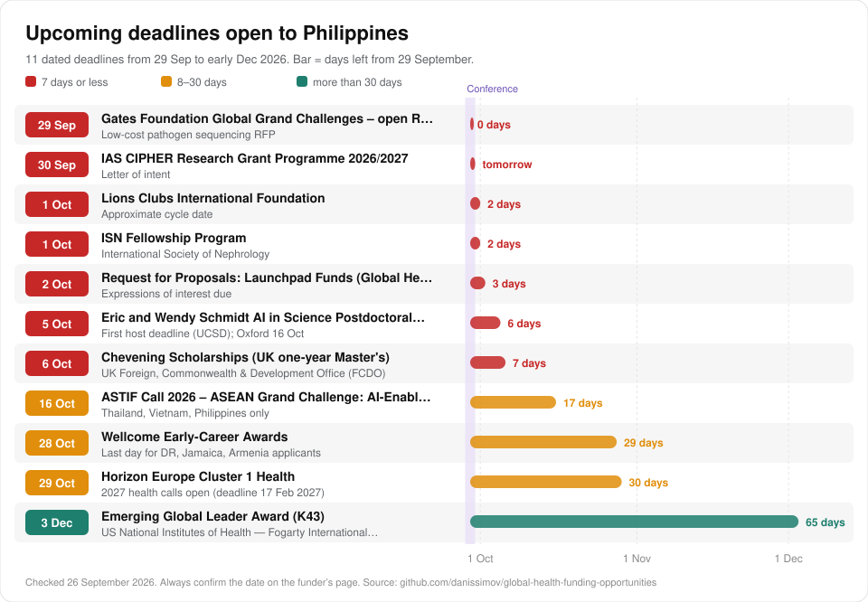

# Health research funding in Philippines

[Back to the full list](../README.md) · [Interactive atlas](https://danissimov.github.io/global-health-funding-opportunities/)

> **Upper-middle income (since 1 July 2026)** · Domestic funding: **Strong** · 95 opportunities · Checked 26 September 2026

The World Bank moved the Philippines to upper-middle income on 1 July 2026. The regional research networks of DOST-PCHRD fund small, practical studies, and hospital staff can apply.

## Which funder lists is Philippines on?

| Funder rule | Philippines |
| --- | --- |
| Wellcome, applying directly | Yes |
| UK NIHR global health | No |
| EU Horizon Europe / EDCTP3 | Horizon Europe: yes, automatically eligible |
| UK Academy of Medical Sciences networking grants | Yes (stream 2) |
| Commonwealth scholarships | No, not a member |
| US bilateral health agreement | Strategic Objective Agreement signed |
| Research4Life journal access | Not on the core lists |

## Best first moves

1. **[PCHRD Regional Research Fund (RRF) via Regional Health Research & Development Consortia](https://www.pchrd.dost.gov.ph/what-we-do/research-and-development-rd-grant/)**. Regional Research Fund, PHP 0.5 to 1 million. Contact your regional consortium.
2. **[DOH Centers for Health Development regional research grants](https://www2.fundsforngos.org/individuals/doh-caraga-call-for-research-proposals-2026-philippines/)**. Regional Department of Health grants. Yearly calls in early 2027.
3. **[Academy of Medical Sciences Networking Grants (ISPF-funded)](https://acmedsci.ac.uk/grants-and-programmes/grants/networking-grants)**. Up to £25,000 with a UK co-applicant.
4. **[DOST Balik Scientist Program (health track via PCHRD)](https://bsp.dost.gov.ph/)**. Brings diaspora scientists home. Open all year.
5. **[Wellcome Early-Career Awards](https://wellcome.org/research-funding/schemes/wellcome-early-career-awards)**. South-East Asia stays eligible.

## Next deadlines

| Date | Opportunity | Note |
| --- | --- | --- |
| 29 Sep 2026 | [Global Grand Challenges (topic-specific RFPs)](https://gcgh.grandchallenges.org/grant-opportunities) | Low-cost pathogen sequencing RFP |
| 30 Sep 2026 | [IAS CIPHER Research Grant Programme 2026/2027](https://www.iasociety.org/grants/cipher-grant-programme-2026-2027) | Letter of intent |
| 1 Oct 2026 | [Lions Clubs International Foundation](https://www.lionsclubs.org/en/lcif-grants-toolkit) | Approximate cycle date |
| 1 Oct 2026 | [ISN Fellowship Program](https://fellowship.theisn.org/) | Closes |
| 6 Oct 2026 | [Chevening Scholarships (UK one-year Master's)](https://www.chevening.org/scholarships/application-timeline/) | Closes |
| 29 Oct 2026 | [Horizon Europe Cluster 1 Health](https://horizoneuropencpportal.eu/store/overview-health-calls-2026-and-2027-horizon-europe) | 2027 health calls open (deadline 17 Feb 2027) |
| 10 Nov 2026 | [Wellcome Early-Career Awards](https://wellcome.org/research-funding/schemes/wellcome-early-career-awards) | Submission (already-registered applicants only) |
| 3 Dec 2026 | [Emerging Global Leader Award (K43)](https://www.fic.nih.gov/Programs/Pages/emerging-global-leader.aspx) | Closes |

## National and domestic funders

Full details, because these are the most likely first grants.

#### [PCHRD Regional Research Fund (RRF) via Regional Health Research & Development Consortia](https://www.pchrd.dost.gov.ph/what-we-do/research-and-development-rd-grant/)

*DOST-PCHRD through RHRDCs (e.g., RHRDC XI Davao, Metro Manila HRDC, Region 1)* · Generally <= PHP 500,000 (~USD 8.8k) · 6-12 months  
`best fit`

- **What it funds:** Small projects addressing regional health research priorities (2023-2028), aimed at early-career researchers outside elite centres.
- **Who can apply:** Researchers from consortium member institutions (universities, DOH hospitals, CHDs); early-career Filipino health researchers prioritised.
- **Status on 26 September 2026:** Rolling/region-specific - contact your RHRDC. Deadline: Region-specific calls; typically annual.
- **How to apply:** Find your regional consortium site (regionX.healthresearch.ph); confirm your institution is a member.

#### [DOH Centers for Health Development regional research grants](https://www2.fundsforngos.org/individuals/doh-caraga-call-for-research-proposals-2026-philippines/)

*Department of Health - regional Centers for Health Development (e.g., Caraga, Northern Mindanao)* · Caraga 2026: up to PHP 1,150,000 (~USD 20k), 2 projects · ~1 year  
`best fit`

- **What it funds:** Operational and health-systems research on regional priorities (infectious disease, NCDs, Indigenous Peoples' health, health-system strengthening).
- **Who can apply:** Researchers in the region incl. hospital and LGU health staff.
- **Status on 26 September 2026:** Closed - annual; expect early-2027 calls. Deadline: Caraga and Northern Mindanao 2026 calls closed early 2026 (N. Mindanao 26 Feb 2026).
- **How to apply:** Watch your CHD's research unit announcements; align with regional research agenda.

#### [DOST Balik Scientist Program (health track via PCHRD)](https://bsp.dost.gov.ph/)

*Department of Science and Technology* · Short-term to long-term (multi-year)

- **What it funds:** Brings Filipino scientists/clinicians abroad back short-, medium- or long-term to host institutions; BSP R&D grants for approved Balik Scientists.
- **Who can apply:** Filipino experts based abroad; local institutions act as hosts - local clinicians can invite diaspora collaborators.
- **Status on 26 September 2026:** Rolling. Deadline: Rolling; processing up to ~1 month if complete.
- **How to apply:** Bsp.dost.gov.ph - host institution and returning scientist co-apply.

#### [DOST-PCHRD Call for Proposals for Health R&D (Grants-in-Aid)](https://www.pchrd.dost.gov.ph/calls_and_events/2026-call-for-proposals-for-health-rd-for-2028-funding/)

*DOST Philippine Council for Health Research and Development (PCHRD)* · Typically 1-3 years  
`AI`

- **What it funds:** Health R&D in priority areas of the National Unified Health Research Agenda (NUHRA 2023-2028) and DOST HNRDA, incl. diagnostics, digital health, drug discovery, health systems.
- **Who can apply:** Researchers at universities, hospitals, research institutions (public or private) registered in DOST DPMIS.
- **Status on 26 September 2026:** Closed - next CFP expected ~early-mid 2027. Deadline: 2026 CFP closed 31 May 2026 (for 2028 funding); POLISEE closed 20 Mar 2026.
- **How to apply:** Download CFP kit (tinyurl.com/2026PCHRDCFP); register on DOST DPMIS.

#### [NRCP Basic Research Grants](https://nrcp.dost.gov.ph/basic-research-grants/)

*National Research Council of the Philippines (DOST-NRCP)*

- **What it funds:** Basic and policy research aligned with the National Integrated Basic Research Agenda (incl. health).
- **Who can apply:** Regular and Associate NRCP members only - membership required first.
- **Status on 26 September 2026:** Uncertain - check BRIS for current window. Deadline: 2026 DOST call for basic research concept proposals (see NRCP site).
- **How to apply:** Apply for NRCP membership; submit concept on basicresearch.nrcp.dost.gov.ph.

#### [UP System Enhanced Creative Work and Research Grant (ECWRG)](https://ovpaa.up.edu.ph/research-innovation/enhanced-creative-work-and-research-grant/)

*University of the Philippines System (OVPAA)* · PHP 450,000-650,000 by rank (~USD 7.9k-11.4k) · 18 months

- **What it funds:** Faculty/researcher projects leading to publications or other outputs (incl. UP Manila/PGH clinicians with faculty appointments).
- **Who can apply:** UP faculty (Instructor 4+) and REPS (University Researcher 1+); publication required before full release.
- **Status on 26 September 2026:** Uncertain - check CU research office. Deadline: Per UP OVPAA announcements (2026 guidelines posted May 2026).
- **How to apply:** Submit via your CU Office of the Vice Chancellor for Research.

## International funders open to Philippines

Grouped by type. Open the link for the full call. The same entries, with more detail, are in the [data files](../data/).

### Regional bodies and development banks

- [TDR Impact Grants](https://tdr.who.int/home/our-work/global-engagement/tdr-small-research-grants-scheme) - `best fit` *TDR with WHO regional offices.* Small implementation-research grants on infectious diseases of poverty tied to each region's priorities (e.g., WPRO 2025-26: reaching the unreached with a communicable-disease focus; EURO 2025: TB/HIV co-infection, parasitic… US$10,000-15,000 per grant (WPRO 2025-26 and EURO 2025: up to US$15,000). *Closed now; next round expected.*
- [Horizon Europe Cluster 1 Health](https://horizoneuropencpportal.eu/store/overview-health-calls-2026-and-2027-horizon-europe) - `AI` *European Commission.* Collaborative research across six health destinations (e.g., infectious diseases, NCDs, health systems, digital health/AI, environment and health). Mostly EUR 1.5m-10m per project (consortium level). *Closed now; next round expected. 29 Oct 2026: 2027 health calls open (deadline 17 Feb 2027).*
- [Marie Sklodowska-Curie Actions (MSCA)](https://marie-sklodowska-curie-actions.ec.europa.eu/) - *European Commission.* Postdoctoral Fellowships (European or Global, any discipline) and Staff Exchanges that fund short secondments of staff between partner organisations, including with non-EU countries. PF: unit-cost based living/mobility allowances (2026 call budget EUR 399m, ~1,600 fellowships). *Closed now; next round expected.*

### Multilateral and global health initiatives

- [IAEA Coordinated Research Projects (CRPs)](https://www.iaea.org/services/coordinated-research-activities/how-to-participate) - `best fit` `AI` *International Atomic Energy Agency.* Institutions join multi-country CRPs; developing-country institutes receive research contracts to run their part of the protocol (e.g., AI-assisted contouring in radiotherapy, CT-based prostate contouring with an AI tool… Modest contract support. *Open all year.*
- [CEPI Calls for Proposals (epidemic/pandemic vaccines and enabling science)](https://cepi.net/calls-for-proposals/) - `AI` *Coalition for Epidemic Preparedness Innovations.* Vaccine R&D, manufacturing, and enabling science including epidemiology, modelling, immunology and AI for priority pathogens and Disease X; outbreak-response calls (e.g., Bundibugyo virus in DRC and Uganda, 2026). *Open all year.*
- [IAEA Technical Cooperation (TC) Programme](https://www.iaea.org/services/technical-cooperation-programme/how-it-works) - *International Atomic Energy Agency.* Capacity building where nuclear techniques add value: radiotherapy and nuclear medicine services, medical physics, diagnostic imaging QA, nutrition isotope techniques; delivered as equipment, expert missions, training courses… In-kind (equipment, training, fellowships). *Open all year.*
- [UNICEF Venture Fund (frontier tech incl. AI for child health; Climate Ventures 2026)](https://www.unicef.org/innovation/venturefund) - `AI` *UNICEF Office of Innovation.* Equity-free investments in early-stage, open-source frontier-tech solutions (AI/ML, data science, blockchain, drones, XR) for children's health, nutrition, mental health and climate-health (early warning, disease forecasting… Up to US$100,000 equity-free. *Closed now; next round expected.*
- [Global Fund Grant Cycle 8 (2026-2028) country grants](https://www.theglobalfund.org/en/news/2026/2026-02-18-global-fund-board-welcomes-final-eighth-replenishment-outcome/) - *The Global Fund to Fight AIDS.* Country grants to national programmes; operational research, program evaluation and surveys can be budgeted in grants (typically under M&E/RSSH), and PRs/sub-recipients sometimes contract local researchers. *Status not confirmed.*
- [Stop TB Partnership](https://www.stoptb.org/what-we-do/accelerate-tb-innovations/tb-reach/waves-funding/wave-11) - Rapid, innovative projects to find and treat people with TB and test new delivery approaches (Wave 11: integrating TB and lung health at primary/community level; Wave 11 Plus: near-point-of-care TB tests in routine conditions)… Wave 11: up to US$550,000 per grant (28 projects, US$14.5m, 15 countries approved June 2024). *Status not confirmed.*
- [WHO headquarters, regional and country office commissioned research](https://www.who.int) - *World Health Organization.* Specific studies, evidence reviews, surveys and evaluations that WHO offices contract out to local institutions and researchers to inform guidelines and national programmes. *Status not confirmed.*
- [WHO-hosted research partnerships: Alliance for Health Policy and Systems Research](https://ahpsr.who.int/) - *WHO-hosted partnerships.* AHPSR commissions health policy and systems research through targeted requests for proposals; HRP supports SRHR research and research-capacity strengthening through its HRP Alliance hubs and ad-hoc small grants. *Status not confirmed.*

### Foreign governments and research councils

- [Emerging Global Leader Award (K43)](https://www.fic.nih.gov/Programs/Pages/emerging-global-leader.aspx) - `best fit` *US National Institutes of Health.* Mentored research career-development award for early-career scientists holding a faculty or research post at an LMIC institution. Up to US$100,000/yr salary. *Open, closes 3 Dec 2026.*
- [Dissemination and Implementation Research in Health](https://grants.nih.gov/grants/guide/pa-files/PAR-25-233.html) - `best fit` *US NIH.* Small and exploratory studies on how to spread, adopt, implement and sustain evidence-based health interventions in real-world clinical and public-health settings. NIH standard: R03 up to US$50,000/yr direct for 2 yrs. *Open.*
- [Academy of Medical Sciences Networking Grants (ISPF-funded)](https://acmedsci.ac.uk/grants-and-programmes/grants/networking-grants) - `best fit` Small grants for networking and collaboration between an overseas lead researcher and a UK co-applicant: workshops, travel and pilot data. Up to £25,000. *Closed now; next round expected.*
- [Advancing Global Health Annual Program Statement (APS)](https://www.grants.gov/search-results-detail/363649) - *US Department of State.* Awards to organizations that 'complement, extend and/or fill identified gaps' in implementing the bilateral health MOUs. Up to US$4.5 billion total ceiling across all awards. *Open.*
- [CDC Global Health Center](https://www.cdc.gov/global-health/) - *US Centers for Disease Control and Prevention.* Global health security, polio and measles, HIV/TB and field epidemiology (FETP) support, mainly through cooperative agreements with ministries of health, public-health institutes and universities. FY2027 request US$663.8m for the Center for Global Health (flat). *Open.*
- [Global-health funding across other NIH Institutes](https://www.fic.nih.gov/Funding/Pages/NIH-funding-opportunities.aspx) - *US National Institutes of Health.* Investigator-initiated and targeted research on HIV, TB, malaria, cancer, mental health, cardiometabolic disease and other conditions, including studies at LMIC sites. *Open.*
- [IDRC (International Development Research Centre)](https://idrc-crdi.ca/en/funding) - `AI` Research by Global South institutions on health systems, sexual and reproductive health, climate and health, and AI. *Open.*
- [Digital Health Technology and Reciprocal Innovation program](https://www.fic.nih.gov/About/Advisory/Pages/funding-concepts.aspx) - `AI` *US NIH.* Proposed program for developing, validating, implementing and evaluating digital health tools — mHealth, AI/ML, digital diagnostics, telehealth, clinical decision support — for low-resource settings in LMICs and underserved US… *Closed now; next round expected.*
- [Fogarty Research Training Programs (D43)](https://www.fic.nih.gov/Programs/Pages/default.aspx) - *US NIH.* Institutional research-training grants that build a cadre of LMIC researchers through degree and non-degree training, mentoring and small research projects. *Closed now; next round expected.*
- [GACD 11th joint call](https://cihr-irsc.gc.ca/e/54557.html) - *Canadian Institutes of Health Research.* Implementation research on NCD prevention, screening and continuity of care, using settings and sectors beyond the formal health system (communities, NGOs, faith-based groups) in LMICs and underserved high-income-country… CIHR: up to CA$200,000/yr, max CA$1,000,000 per grant. *Closed now; next round expected.*
- [Grand Challenges Canada](https://www.grandchallenges.ca/apply-for-funding/) - Innovation grants for 'bold ideas with big impact': Proof of Concept and Transition to Scale funding for locally led health innovations. *Closed now; next round expected.*
- [Research Council of Norway](https://www.forskningsradet.no/en/call-for-proposals/2026/researcher-project-for-early-career-scientists-on-global-health-and-development-research/) - Early-career-led research on health inequalities, health security, poverty and development, with equitable joint leadership by partners in low- and lower-middle-income countries. NOK 4–10 million per project (NOK 120m pot in 2026). *Closed now; next round expected.*
- [Solution-oriented Research for Development (SOR4D)](https://www.snf.ch/en/Fb19rz5iYXpbuPyy/funding/programmes/sor4d-programme) - *Swiss National Science Foundation.* Transdisciplinary, solution-oriented research by mixed consortia (Swiss researchers + ODA-country researchers + non-academic practice partners) on the SDGs, including human development and health. CHF 22.4 million total for Phase 2 (per-project amount in the call document). *Closed now; next round expected.*
- [Australia](https://www.nhmrc.gov.au/funding) - *National Health and Medical Research Council.* NHMRC funds Australian-led research, including international collaborations and GACD calls. *Status not confirmed.*
- [Belgium — VLIR-UOS university cooperation and ITM–DGD framework programme](https://www.vliruos.be/en/calls) - Institutional university cooperation, joint research projects, scholarships (master's and PhD) and ITM's capacity-strengthening partnerships in tropical medicine and public health. *Status not confirmed.*
- [Germany — BMFTR (formerly BMBF) global health programmes, DFG international cooperation, DAAD scholarships, Else Kröner-Fresenius-Stiftung, GIZ](https://www.daad.de/en/studying-in-germany/scholarships/) - BMFTR: research networks and product development for neglected and poverty-related diseases, mainly with African partners. *Status not confirmed.*
- [Global Brain and Nervous System Disorders Research Across the Lifespan](https://www.fic.nih.gov/Programs/Pages/brain-disorders.aspx) - *US NIH.* Collaborative research on nervous-system development, function and disorders (neurological, mental health, substance use) relevant to LMICs across the life course. R21: NIH standard is up to US$275,000 direct over 2 years (confirm in the NOFO). *Status not confirmed.*
- [Korea — KOICA and KOFIH (Korea Foundation for International Healthcare) health programmes and fellowships](https://www.kofih.org/en) - *Korea International Cooperation Agency.* Bilateral health-system projects and health-workforce training. *Status not confirmed.*
- [SATREPS — Science and Technology Research Partnership for Sustainable Development](https://www.jst.go.jp/global/english/) - *Japan Agency for Medical Research and Development.* Joint Japan–ODA-country research projects. *Status not confirmed.*
- [Sida research cooperation (and Swedish Research Council development research)](https://www.sida.se/en/for-partners/research-partners) - *Swedish International Development Cooperation Agency.* Sida builds national research systems through bilateral university partnerships ('sandwich' PhDs) in Bolivia, Cambodia, Ethiopia, Mozambique, Rwanda and Tanzania, and funds global partners (EDCTP, TDR, the Alliance for Health… *Status not confirmed.*
- [UKRI Medical Research Council (MRC)](https://www.ukri.org/what-we-do/browse-our-areas-of-investment-and-support/applied-global-health/) - *UK Research and Innovation.* Previously applied global health research and partnerships (Applied Global Health Research, Applied Global Health Partnership). *Paused.*

### Foundations and charities

- [IAS CIPHER Research Grant Programme 2026/2027](https://www.iasociety.org/grants/cipher-grant-programme-2026-2027) - `best fit` *International AIDS Society.* Early-stage investigators addressing paediatric and adolescent HIV research gaps; 2026 focus: prevention of vertical transmission, adolescent HIV prevention, co-morbidities (cardiometabolic, hepatitis, TB). Up to USD 140,000. *Open. 30 Sep 2026: Letter of intent.*
- [Conquer Cancer International Innovation Grant (IIG)](https://www.asco.org/career-development/grants-awards/funding-opportunities/international-innovation-grant) - `best fit` Novel, hypothesis-driven cancer control projects in LMICs with potential to reduce local cancer burden and transfer to other LMIC settings. Up to USD 20,000 (two instalments). *Closed now; next round expected.*
- [Grand Challenges AI calls (Catalyzing Equitable AI Use; AI-Enabled Family Planning; AI for Charitable Giving)](https://gcgh.grandchallenges.org/challenge/catalyzing-equitable-artificial-intelligence-ai-use) - `best fit` `AI` *Gates Foundation.* AI/LLM-specific Grand Challenges. 2023 equitable-AI round: up to USD 100,000. *Closed now; next round expected.*
- [ISN Clinical Research Program](https://www.theisn.org/in-action/grants/isn-clinical-research/) - `best fit` *International Society of Nephrology.* Research and education projects detecting/managing CKD, AKI, hypertension, diabetes and cardiovascular disease, involving nephrologists, health workers and local authorities; plus a scientific writing course. *Closed now; next round expected.*
- [Thrasher Research Fund Early Career Award (and E.W. 'Al' Thrasher Award)](https://www.thrasherresearch.org/early-career-award?lang=eng) - `best fit` Small grants for new child-health researchers (mostly development-stage clinical research, some implementation science) working with a mentor. Up to USD 25,000 direct + 7% indirect (max USD 26,750). *Closed now; next round expected.*
- [Rotary Foundation Global Grants and District Grants](https://www.rotary.org/get-involved/our-programs/grants) - `best fit` Humanitarian projects, vocational training teams and graduate scholarships in Rotary areas of focus, including disease prevention and treatment and maternal and child health. Global grant budgets: minimum USD 30,000, maximum USD 400,000 (per 2026 guides). *By invitation or through a local network.*
- [RSTMH Early Career Grants Programme](https://www.rstmh.org/grants) - `best fit` *Royal Society of Tropical Medicine and Hygiene.* First grants for people who have not held equivalent research funding in their own name; any area of tropical medicine or global health (lab, clinical, implementation, policy). Up to GBP 5,000. *Paused.*
- [Global Grand Challenges (topic-specific RFPs)](https://gcgh.grandchallenges.org/grant-opportunities) - *Gates Foundation.* Short, topic-specific open calls for innovative solutions to global health and development problems (diagnostics, pathogen genomics, nutrition, AI). Pathogen sequencing call: Tier 1 up to USD 300,000. *Open. 29 Sep 2026: Low-cost pathogen sequencing RFP.*
- [Wellcome Early-Career Awards](https://wellcome.org/research-funding/schemes/wellcome-early-career-awards) - Early-career researchers (any discipline) developing their research identity through an innovative project; covers salary plus research costs. Applicant salary + up to GBP 400,000 research expenses. *Open. 10 Nov 2026: Submission (already-registered applicants only).*
- [Wellcome Career Development Awards](https://wellcome.org/research-funding/schemes/wellcome-career-development-awards) - Mid-career researchers from any discipline ready to lead an ambitious research programme and become international research leaders. Research expenditure usually below GBP 250,000 per year (excluding applicant salary). *Open all year. 28 Oct 2026: Last day for DR, Jamaica, Armenia applicants.*
- [Bloomberg Initiative to Reduce Tobacco Use](https://www.tobaccocontrolgrants.org/applications-for-grant-rounds) - *Bloomberg Philanthropies.* Competitive grants for evidence-based tobacco control interventions aligned with the WHO FCTC (policy, enforcement, cessation). *Closed now; next round expected.*
- [Coefficient Giving RFP: Global Health and Wellbeing in an Era of Transformative AI](https://coefficientgiving.org/funds/global-health-wellbeing-opportunities/request-for-proposals-global-health-and-wellbeing-in-an-era-of-transformative-ai/) - `AI` Research, policy, field-building and implementation on how transformative AI will affect health and wellbeing of the global poor (e.g., LMIC clinical-trial/regulatory readiness, AI labour disruption, data public goods). USD 10-30M total. *Closed now; next round expected.*
- [Rockefeller Foundation (health grants) and Bellagio Center Residency](https://www.rockefellerfoundation.org/fellowships-convenings/bellagio-center/residency-program/) - Health grantmaking is largely proactive (Food is Medicine, health systems, AI in public service). Residency: fully funded stay at Lake Como (not a cash research grant). *Closed now; next round expected.*
- [UICC Technical Fellowships](https://www.uicc.org/what-we-do/member-benefits/learning-and-development/fellowships/technical-fellowships) - *Union for International Cancer Control.* Short-term training visits for cancer professionals to acquire specific skills at a host institution abroad (clinical, research, programme management). *Closed now; next round expected.*
- [Wellcome strategic programmes: Climate & Health, Mental Health, Infectious Disease](https://wellcome.org/our-priorities) - Targeted funding calls and commissioned work aligned to Wellcome's health challenge areas (climate and health, mental health, infectious disease) plus discovery research. *Status not confirmed.*
- [Lions Clubs International Foundation](https://www.lionsclubs.org/en/lcif-grants-toolkit) - Lions-led service projects: diabetes screening/camps/workforce training/equipment; childhood cancer care infrastructure with hospitals; vision/blindness prevention. USD 10,000-300,000 depending on grant type. *By invitation or through a local network. 1 Oct 2026: Approximate cycle date.*

### Corporate and tech, including AI

- [Anthropic AI for Science Program (free Claude API credits)](https://support.claude.com/en/articles/11199177-anthropic-s-ai-for-science-program) - `best fit` `AI` Free Claude API credits for researchers at academic/nonprofit institutions applying generative AI to scientific research, including medicine/healthcare; expanded in Aug 2026 to more fields and compute-heavy work. Help-centre terms: up to USD 20,000 in credits for 6 months. *Open.*
- [Claude Team Plan for Scientists (free/discounted seats)](https://claude.com/programs/team-plan-for-scientists) - `best fit` `AI` *Anthropic.* 10,000 free standard Claude seats (premium seats with 5x usage at USD 15/month) for one year for research labs; the PI verifies and adds lab members. Free standard seats. *Open.*
- [AWS Cloud Credit for Research (and status of AWS Health Equity Initiative)](https://aws.amazon.com/government-education/research-and-technical-computing/cloud-credit-for-research/) - `AI` *Amazon Web Services.* AWS promotional credits for research workloads, science-as-a-service tools and training (can include Amazon Bedrock generative AI). Faculty/staff awards not capped. *Open.*
- [Google Cloud Research Credits](https://cloud.google.com/edu/researchers) - `AI` Cloud computing credits (incl. USD 5,000 research credits (standard offer). *Open.*
- [NVIDIA Academic Grant Program](https://www.nvidia.com/en-us/industries/higher-education-research/academic-grant-program/) - `AI` GPU compute hours or hardware for academic research in simulation/modelling, AI training/model development, and AI inference/agents. Up to 30,000 NVIDIA H100 GPU-hours, or hardware. *Open.*
- [Pfizer Global Medical Grants (Competitive Grant RFPs) and Investigator Sponsored Research](https://www.pfizer.com/about/programs-policies/grants/competitive-grants) - Independent research, quality improvement and education projects in areas aligned with Pfizer's medical strategy via publicly posted RFPs (some global); separately, investigator-sponsored research (ISR) on Pfizer products. *Open.*
- [Pharma investigator-initiated/supported study programmes](https://iss.gsk.com/) - *Various pharmaceutical companies.* Investigator-designed studies (often observational/real-world or pragmatic) related to a company's products or disease areas; support may be funding and/or drug supply. *Open all year.*
- [AstraZeneca Young Health Programme (YHP) incl. YHP Impact Fellowship](https://www.oneyoungworld.com/scholarship/astrazeneca-young-health-programme-impact-fellowship) - Youth health equity (NCD prevention, mental health) with UNICEF and 60+ NGOs; new 2026-2030 phase. Fellowship grant USD 10,000 (USD 50,000 for the Lead2030 SDG3 winner). *Closed now; next round expected.*
- [Google.org Impact Challenge: AI for Science](https://www.google.org/impact-challenges/ai-science/) - `AI` USD 30M global open call for AI-driven scientific breakthroughs in Health & Life Sciences and Climate; includes a Google.org Accelerator, pro bono Google experts and Cloud credits. USD 500,000-3,000,000. *Closed now; next round expected.*
- [Lacuna Fund (labelled ML datasets for LMIC contexts)](https://lacunafund.org/apply/index.html) - `AI` Creation, expansion and maintenance of open, locally owned, ML-ready labelled datasets in health, language, agriculture and climate (e.g., medical Q&A datasets, imaging for screening, maternal health data). Historically USD 20,000-100,000 small/medium. *Status not confirmed.*
- [Meta Llama Impact Grants](https://www.llama.com/llama-ai-innovation/) - `AI` Projects using open-source Llama models for social impact (health, education, agriculture), e.g., offline multilingual medical assistance. Past round: up to USD 500,000 per recipient (USD 2M pool). *Status not confirmed.*

### Fellowships, training and small grants

- [ISN Fellowship Program](https://fellowship.theisn.org/) - `best fit` *International Society of Nephrology.* Clinical/research nephrology training abroad for physicians from low-resource regions, who return home to build kidney care. *Open, closes 1 Oct 2026.*
- [Chevening Scholarships (UK one-year Master's)](https://www.chevening.org/scholarships/application-timeline/) - `best fit` *UK Foreign, Commonwealth & Development Office.* Fully funded one-year taught Master's at any UK university (e.g., MPH, MSc Global Health, Tropical Medicine, Health Policy); leadership network. *Open, closes 6 Oct 2026.*
- [DAAD EPOS](https://www2.daad.de/deutschland/stipendium/datenbank/en/21148-scholarship-database/?detail=50076777) - `best fit` Master's/PhD in development-related courses in Germany, including MSc International Health (Charite Berlin, Heidelberg) and Global Health (Bonn). EUR 992/month (Master's). *Open.*
- [Fulbright Foreign Student Program and Fulbright Visiting Scholar Program](https://foreign.fulbrightonline.org/) - `best fit` *US Department of State.* Foreign Student: graduate study (MPH, MSc, PhD) in the US. *Open.*
- [IAS fellowships](https://www.iasociety.org/fellowships) - `best fit` *International AIDS Society.* Mark Wainberg: 2-year clinical HIV-management training (1 year at a clinical institution, 1 year research project). *Open.*
- [Rising Scholars (formerly AuthorAID, INASP)](https://risingscholars.net/en/) - `best fit` `AI` Free online mentoring, collaboration network, and free courses in research writing, proposal writing and AI in research. Free. *Open.*
- [SORT IT - Structured Operational Research and Training IniTiative](https://tdr.who.int/activities/sort-it-operational-research-and-training) - `best fit` *TDR (coordinator) with implementing partners (WHO offices.* Mentored, milestone-based training in which each participant completes their own operational research project from protocol to published paper and policy brief (4 modules: protocol, data, manuscript, research communication). In-kind: tuition, mentorship and usually module travel covered by the course sponsor. *Open all year.*
- [Atlantic Fellows for Health Equity](https://healthequity.atlanticfellows.org/apply/) - `best fit` *Atlantic Philanthropies / Atlantic Institute.* Year-long, non-residential leadership fellowship with three in-person global convenings and online modules on health equity. *Closed now; next round expected.*
- [Australia Awards Scholarships](https://www.dfat.gov.au/people-to-people/australia-awards/participating-countries) - `best fit` *Australian Government.* Full-time postgraduate study at Australian universities (public health, nursing, health management often priority fields). *Closed now; next round expected.*
- [Hubert H. Humphrey Fellowship Program](https://www.humphreyfellowship.org/) - `best fit` *US Department of State.* 10 months of non-degree graduate study and professional development at a US university (Public Health and HIV/AIDS/Substance Abuse tracks are common host themes). *Closed now; next round expected.*
- [IAS conference scholarships (AIDS / IAS / HIVR4P conferences)](https://www.iasociety.org/scholarships) - `best fit` *International AIDS Society.* Registration, travel and accommodation (in-person) or virtual access to IAS conferences, plus 2 years free IAS membership. *Closed now; next round expected.*
- [Swedish Institute Scholarships for Global Professionals (SISGP)](https://si.se/en/apply/scholarships/swedish-institute-scholarships-for-global-professionals/) - `best fit` Full-time Master's in Sweden for working professionals with leadership potential (global health programmes at Karolinska, Uppsala, Lund etc.). *Closed now; next round expected.*
- [Union World Conference on Lung Health scholarships](https://worldlunghealth.org/scholarships-and-sponsored-registrations/) - `best fit` *International Union Against Tuberculosis and Lung Disease.* Full scholarships (registration, travel, accommodation) for presenters from low- and lower-middle-income countries; sponsored registrations for others. *Closed now; next round expected.*
- [Field Epidemiology Training Programmes (FETP)](https://www.tephinet.org/) - `best fit` *National ministries of health with CDC.* Paid, service-based applied epidemiology training (Frontline 3 months, Intermediate ~9 months, Advanced 2 years). Salary continues. *Status not confirmed.*
- [Young Southeast Asian Leaders Initiative (YSEALI) fellowships](https://asean.usmission.gov/ysealiafp/) - *US Department of State.* Academic Fellows (5-week US institute, ages 18-25) and Professional Fellows (US placements for young professionals); YSEALI seed grants for alumni. *Open.*
- [Rotary Global Grant Scholarships and Rotary Peace Fellowships](https://www.rotary.org/en/our-programs/peace-fellowships) - *The Rotary Foundation / local Rotary districts.* Global grant scholarships fund graduate study abroad in Rotary areas of focus (incl. disease prevention and treatment; maternal and child health). *Open all year.*
- [ASTMH Annual Meeting Travel Awards](https://www.astmh.org/annual-meeting/awards) - *American Society of Tropical Medicine and Hygiene.* Registration, round-trip airfare and stipend for students, early-career investigators and scientists in tropical medicine (incl. Registration + airfare + stipend. *Closed now; next round expected.*
- [CUGH conference bursaries and awards](https://cughlima2027.org/) - *Consortium of Universities for Global Health.* Free registration, hotel and travel stipend for abstract presenters from low/lower-middle-income countries (reported ~10 bursaries); CUGH also runs competitions/awards. Registration + hotel + travel stipend. *Closed now; next round expected.*
- [Erasmus Mundus Joint Master scholarships (e.g., Europubhealth+)](https://www.europubhealth.org/application-procedure/) - *European Commission.* Two-year joint Master's across several European universities; public health options include Europubhealth+ and other health programmes in the EMJM catalogue. Tuition, travel, insurance and EUR 1,400/month. *Closed now; next round expected.*
- [IARC Postdoctoral Fellowships and Return Grants (cancer research)](https://training.iarc.who.int/postdoctoral-fellowships-intro/) - *International Agency for Research on Cancer.* Two-year postdoctoral training at IARC (Lyon) in cancer epidemiology, prevention and related fields, with an optional return grant to start research at home. 2025 call: stipend EUR 2,950/month net plus travel. *Closed now; next round expected.*
- [Japanese Government (MEXT) Scholarship](https://www.studyinjapan.go.jp/en/smap-stopj-applications-research.html) - *Japan Ministry of Education.* Master's/PhD or non-degree research at Japanese universities, including medicine and public health. *Closed now; next round expected.*
- [KOICA Scholarship Program](https://www.koica.go.kr/ciat/index.do) - *Korea International Cooperation Agency.* Development-oriented Master's (and some PhD) programmes at Korean universities; health-related programmes offered in some years. *Closed now; next round expected.*
- [TDR Implementation Research Leadership Fellowship Programme for Public Health Impact](https://tdr.who.int/docs/librariesprovider10/calls-for-applications/ir-leadership-fellowship-call-for-applications-december-2026.pdf) - *TDR, hosted by Universitas Gadjah Mada.* Six-month in-person leadership fellowship in implementation research, with two streams: academics/researchers (lead an IR project at home institution) and public-health practitioners in managerial roles (integrate IR into a… Fully funded: return airfare, monthly stipend, insurance, IR project expenses incl.…. *Closed now; next round expected.*
- [TDR Postgraduate Training Scheme](https://tdr.who.int/grants) - *TDR via regional training centres.* Full scholarships for master's degrees with an implementation-research focus at TDR-supported universities in LMICs, including a research project relevant to the scholar's home programme. Full scholarship (tuition, stipend, travel) - exact value varies by host. *Closed now; next round expected.*
- [World Federation of Neurology grants-in-aid and Junior Travelling Fellowships](https://wfneurology.org/activities/education-grants-and-awards) - Educational grants-in-aid (education/patient-education projects), Junior Travelling Fellowships to meetings, department visits/observerships. *Closed now; next round expected.*
- [ASCO IDEA and ESMO Fellowships (oncology)](https://www.asco.org/career-development/grants-awards/funding-opportunities/international-development-education-award) - *ASCO / Conquer Cancer.* ASCO IDEA: travel to ASCO Annual Meeting plus mentorship and US cancer-centre visit for early-career oncologists from LMICs (incl. palliative-care track). *Status not confirmed.*
- [Aspen Institute New Voices Fellowship](https://www.aspenglobalinnovators.org/en/programs/new-voices-fellowship/) - Communications, advocacy and op-ed/media training for development and health experts from Africa, Asia, Latin America & Caribbean. *Status not confirmed.*
- [TDR Clinical Research Leadership (CRL) Fellowship](https://tdr.who.int/grants) - *TDR with pharmaceutical companies and product-development partnerships as hosts.* Placement of LMIC researchers in industry/PDP clinical-development teams to gain skills in trial design, conduct, regulatory and GCP, then return to lead trials at home. *Status not confirmed.*

### Humanitarian and implementation

- [Elrha Humanitarian Innovation Fund (HIF)](https://www.elrha.org/innovation) - `AI` Innovation challenges in humanitarian response (e.g., GBV tech, inclusion data, scaling, AI for humanitarians). *Closed now; next round expected.*
- [Elrha R2HC](https://www.elrha.org/funding-opportunities/r2hc-annual-funding-call) - Public-health research in humanitarian settings; annual calls, responsive crisis calls, uptake/impact small grants. *Closed now; next round expected.*

---

Found a mistake or a new call for Philippines? [Open an issue](https://github.com/danissimov/global-health-funding-opportunities/issues/new/choose).
